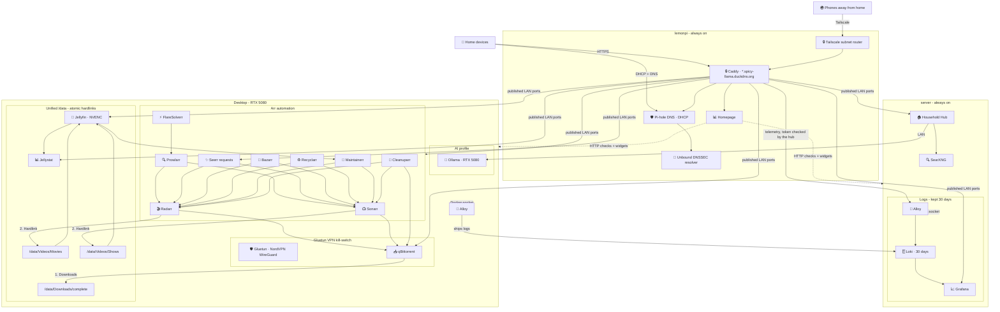

# 🛸 Homelab: Media, Automation & Local AI

[](https://github.com/Anwera64/homelab/actions/workflows/test.yml)
[](https://github.com/Anwera64/homelab/actions/workflows/household-hub-client.yml)
[](https://github.com/Anwera64/homelab/actions/workflows/caddy-image.yml)

A three-host homelab. **lemonpi**, an always-on Raspberry Pi, runs the house network services: DNS and DHCP, the HTTPS entry point, the dashboard and remote access. **The server**, an always-on laptop, runs the apps: the Household Hub and the logs, with the media services to follow. **The desktop** (Windows + Docker Desktop, RTX 5080) runs the media server and the *arr automation pipeline behind a VPN kill-switch for now, plus the local AI model (Ollama) on its GPU. When the desktop is off, the network, the dashboard, remote access, the Hub and the logs keep working.

---

## 🖥️ Hosts

| Host | Address | Always on | Runs | Config |
| :--- | :--- | :--- | :--- | :--- |
| **lemonpi** (Raspberry Pi 5, 1 GB, wired) | `192.168.1.35` · `lemonpi.lan` | Yes | Pi-hole (DNS, ad blocking, DHCP), Unbound (DNSSEC resolver), Caddy (HTTPS for `*.spicy-llama.duckdns.org`), Homepage (dashboard), Tailscale (subnet router) | [`hosts/pi/`](hosts/pi/README.md) |
| **Server** (Lenovo Legion laptop, Debian 13, Wi-Fi) | `192.168.1.30` · `server.lan` | Yes | Household Hub, SearXNG, an Ollama for the Hub's embedder (GTX 1660 Ti), Loki + Alloy + Grafana (all logs), Grafana's image renderer (on demand), Watchtower. The media services follow once its media disk is installed | [`hosts/server/`](hosts/server/README.md) |
| **Desktop** (Windows, RTX 5080, Wi-Fi) | `192.168.1.20` · `desktop-kujo8mp.lan` | No | Jellyfin (NVENC), Seerr, Sonarr, Radarr, Prowlarr, Bazarr, Recyclarr, Maintainerr, Cleanuparr, Jellystat, qBittorrent + FlareSolverr behind Gluetun (NordVPN WireGuard), Watchtower, and the AI profile: Ollama. Alloy ships its container logs to the server | root [`docker-compose.yml`](docker-compose.yml) |

All three addresses are DHCP reservations in Pi-hole (`PIHOLE_DHCP_HOSTS` in `hosts/pi/.env`). Elsewhere this README uses the `.lan` names (`lemonpi.lan`, `server.lan`, `desktop-kujo8mp.lan`), which Pi-hole resolves for every DHCP client.

---

## 🧭 Network Flow

* **DNS and DHCP:** the router (Orange Livebox 7) won't let you change the DNS it hands out, so its DHCP server is off and **Pi-hole serves DHCP**, naming itself as DNS. Pi-hole blocks ads and trackers, then resolves through **Unbound** straight from the root servers with DNSSEC. Unbound exempts `spicy-llama.duckdns.org` from DNS-rebinding protection, because that domain points at the LAN on purpose.
* **HTTPS:** `*.spicy-llama.duckdns.org` resolves to lemonpi. **Caddy on the Pi** holds a Let's Encrypt wildcard certificate (DuckDNS DNS challenge). It serves Homepage and Pi-hole itself, and forwards each service to the port its container publishes on the machine that runs it: the server or the desktop. There's no reverse proxy on either.
* **Remote access:** **Tailscale**. lemonpi advertises the home subnet (`192.168.1.0/24`) and is the tailnet's DNS, so phones get the same names, HTTPS and ad blocking away from home. No ports are forwarded to any service. At most, Tailscale's WireGuard UDP port (41641) is forwarded to the Pi, which helps direct connections but isn't required.
* **Desktop off:** DNS, DHCP, Homepage, Pi-hole, remote access, the Hub (except the chat model, which runs on the desktop's Ollama) and the logs keep working. Media services return a 502 from the Pi's Caddy until the desktop is back.


```mermaid
graph TD
    CLIENTS[📱 Home devices] -->|DHCP + DNS| PIHOLE
    REMOTE[🌍 Phones away from home] -->|Tailscale| TS

    subgraph Pi [lemonpi - always on]
        TS[🔒 Tailscale subnet router]
        PIHOLE[🛡️ Pi-hole DNS · DHCP] --> UNBOUND[🔁 Unbound DNSSEC resolver]
        CADDY[🔒 Caddy · *.spicy-llama.duckdns.org]
        CADDY --> HOMEPAGE[📊 Homepage]
        CADDY --> PIHOLE
    end

    CLIENTS -->|HTTPS| CADDY
    TS --> CADDY

    subgraph Server [server - always on]
        HUB[🏠 Household Hub]
        HUB --> SEARX[🔍 SearXNG]

        subgraph Logs [Logs - kept 30 days]
            ALLOY[🚚 Alloy] --> LOKI[🗄️ Loki · 30 days] --> GRAFANA[📈 Grafana]
        end
    end

    subgraph Desktop [Desktop - RTX 5080]
        DALLOY[🚚 Alloy]

        subgraph VPNNet [Gluetun VPN kill-switch]
            GLUETUN[🛡️ Gluetun · NordVPN WireGuard]
            QBIT[📥 qBittorrent]
        end

        subgraph ArrSuite [Arr automation]
            PROW[🔍 Prowlarr] --> RAD[🎬 Radarr] & SON[📺 Sonarr]
            FLARE[⚡ FlareSolverr] --> PROW
            SEERR[✨ Seerr requests] --> RAD & SON
            RAD & SON --> QBIT
            BAZ[📝 Bazarr] --> RAD & SON
            RECYC[♻️ Recyclarr] --> RAD & SON
            MAINT[🧹 Maintainerr] --> RAD & SON
            CLEAN[🧽 Cleanuparr] --> RAD & SON & QBIT
        end

        subgraph MediaStorage [Unified /data - atomic hardlinks]
            QBIT -->|1. Downloads| DOWN["/data/Downloads/complete"]
            RAD -->|2. Hardlink| MOVIES["/data/Videos/Movies"]
            SON -->|2. Hardlink| SHOWS["/data/Videos/Shows"]
            MOVIES & SHOWS --> JELLY[🍿 Jellyfin · NVENC]
            JELLY --> JSTAT[📊 Jellystat]
            JELLY --> MAINT
        end

        subgraph AIStack [AI profile]
            OLLAMA[🦙 Ollama · RTX 5080]
        end
    end

    HUB -->|LAN| OLLAMA
    DALLOY[🚚 Alloy] -->|ships logs| LOKI
    CADDY -->|published LAN ports| JELLY & SEERR & ArrSuite & QBIT & JSTAT & HUB & GRAFANA
    HOMEPAGE -.->|HTTP checks + widgets| Desktop
    HOMEPAGE -.->|HTTP checks + widgets| Server
    Server -.->|Docker socket| ALLOY
    Desktop -.->|Docker socket| DALLOY
    CADDY -->|telemetry, token checked by the hub| ALLOY
```

---

## 🌐 Service Endpoints

| Service | Host | HTTPS (home + Tailscale) | Local HTTP | Role |
| :--- | :--- | :--- | :--- | :--- |
| **Homepage** | lemonpi | `https://home.spicy-llama.duckdns.org` | `http://lemonpi.lan` | Dashboard: HTTP checks for desktop services, Docker status for the Pi's |
| **Pi-hole** | lemonpi | `https://pihole.spicy-llama.duckdns.org/admin` | `http://lemonpi.lan:8081/admin` | DNS, ad blocking and DHCP |
| **Jellyfin** | Desktop | `https://jellyfin.spicy-llama.duckdns.org` | `http://desktop-kujo8mp.lan:8096` | Media server with NVENC transcoding |
| **Seerr** | Desktop | `https://seerr.spicy-llama.duckdns.org` | `http://desktop-kujo8mp.lan:5055` | Request & discovery portal |
| **Jellystat** | Desktop | `https://stat.spicy-llama.duckdns.org` | `http://desktop-kujo8mp.lan:3005` | Playback analytics |
| **qBittorrent** | Desktop | `https://qbit.spicy-llama.duckdns.org` | `http://desktop-kujo8mp.lan:8080` | Download client (VueTorrent), published through Gluetun |
| **Sonarr** | Desktop | `https://sonarr.spicy-llama.duckdns.org` | `http://desktop-kujo8mp.lan:8989` | TV series |
| **Radarr** | Desktop | `https://radarr.spicy-llama.duckdns.org` | `http://desktop-kujo8mp.lan:7878` | Movies |
| **Prowlarr** | Desktop | `https://prowlarr.spicy-llama.duckdns.org` | `http://desktop-kujo8mp.lan:9696` | Indexer proxy |
| **Bazarr** | Desktop | `https://bazarr.spicy-llama.duckdns.org` | `http://desktop-kujo8mp.lan:6767` | Subtitles |
| **Maintainerr** | Desktop | `https://maintainerr.spicy-llama.duckdns.org` | `http://desktop-kujo8mp.lan:6246` | Media lifecycle & cleanup |
| **Cleanuparr** | Desktop | `https://cleanuparr.spicy-llama.duckdns.org` | `http://desktop-kujo8mp.lan:11011` | Download queue cleanup: fakes, failed imports, seeding limits |
| **FlareSolverr** | Desktop | `https://flaresolverr.spicy-llama.duckdns.org` | `http://desktop-kujo8mp.lan:8191` | Cloudflare challenge solver |
| **Household Hub** | Server | `https://hub.spicy-llama.duckdns.org` | `http://server.lan:3051` | Family assistant backend (`/docs` at `http://127.0.0.1:3050` on the server itself) |
| **Grafana** | Server | `https://grafana.spicy-llama.duckdns.org` | `http://server.lan:3002` | Log search (sign-in required) |
| **Gluetun API** | Desktop | — | `http://desktop-kujo8mp.lan:8000` (API key) | VPN status for Homepage |
| **SearXNG** | Server | — | internal `http://searxng:8080` | Private search for the hub |
| **Ollama** | Desktop (AI profile) | — | `http://desktop-kujo8mp.lan:11434` (the server only) | Local LLM inference |
| **Ollama (embedder)** | Server | — | internal `http://ollama:11434` | `bge-m3`, ranks what a chat turn reads |
| **Loki** | Server | — | `http://server.lan:3100` (the desktop's Alloy only) | Log store, 30 days |
| **Alloy** | Server | `https://telemetry.spicy-llama.duckdns.org` | `http://server.lan:4318` | Ships the server's container output to Loki; receives the app's logs (OTLP), after the hub has checked the sender's token |
| **Alloy** | Desktop | — | — | Ships the desktop's container output to the server's Loki |
| **Recyclarr** | Desktop | — | — | TRaSH Guides sync, daily 3 AM |
| **Watchtower** | Server and Desktop | — | — | Image updates, daily 4 AM |

The server has a firewall, so its local HTTP ports answer lemonpi only.

---

## 📁 Repository Structure

```
.
├── .github/
│   └── workflows/
│       ├── test.yml                 # CI: node tests + compose validation
│       ├── household-hub-client.yml # CI: hub client (Kotlin Multiplatform)
│       └── caddy-image.yml          # Builds the Pi's Caddy + DuckDNS image (arm64/amd64) to GHCR
├── .githooks/
│   └── pre-commit                   # Tests, compose validation, architecture checks before every commit
├── docker-compose.yml               # Desktop stack: media services, Ollama, Alloy
├── .env.example                     # Desktop environment template
├── startup_homelab.ps1              # Desktop: start with update check and health checks
├── stop_homelab.ps1                 # Desktop: clean shutdown
├── compact_docker_disk.ps1          # Desktop: shrink Docker's virtual disk
├── enable_virtualization.ps1        # Desktop: Hyper-V / WSL2 setup helper
├── AGENTS.md                        # Development rules (plan first, TDD, Clean Architecture, environment)
├── ROADMAP.md                       # Roadmap
├── hosts/
│   ├── pi/                          # lemonpi, checked out alone on the Pi (sparse clone)
│   │   ├── README.md                # Pi setup, DHCP switch-over, checks, backups
│   │   ├── bootstrap.sh             # Idempotent setup: OS, log2ram, Docker, Tailscale, stack
│   │   ├── docker-compose.yml       # Pi-hole, Unbound, Caddy, Homepage
│   │   ├── .env.example             # Pi secrets template (password, DuckDNS token, leases, API keys)
│   │   ├── caddy/
│   │   │   ├── Caddyfile            # HTTPS routes for *.spicy-llama.duckdns.org
│   │   │   └── Dockerfile           # Caddy + DuckDNS DNS plugin (built by CI)
│   │   └── unbound/
│   │       └── unbound.conf         # Recursive DNSSEC resolver on 127.0.0.1:5335
│   └── server/                      # The always-on app server (laptop): Hub and logs live, media to follow
│       ├── README.md                # Install, bootstrap, firewall, media disk, moving hardware
│       ├── bootstrap.sh             # Idempotent setup: NVIDIA, Docker, SSH, firewall, disk guard, stack
│       ├── docker-compose.yml       # The desktop services and the embedder, with memory caps
│       ├── .env.example             # Server settings template (paths, allowed addresses, secrets)
│       └── system/                  # Firewall, disk guard and battery scripts with their units
├── apps/
│   └── household-hub/               # Household Hub: backend (FastAPI) and client (KMP)
├── config/
│   ├── homepage/                    # Homepage config, served from the Pi
│   │   ├── services.yaml            # Services, widgets and HTTP checks
│   │   ├── adapt-links.js           # Link adapter: HTTPS names remotely, LAN ports locally
│   │   ├── custom.js                # The adapter, running in the browser
│   │   ├── custom.css               # Styling overrides
│   │   ├── settings.yaml            # Layout
│   │   ├── widgets.yaml             # Header widgets
│   │   ├── bookmarks.yaml           # Bookmarks
│   │   └── docker.yaml              # Docker socket (the Pi's own containers)
│   ├── ollama-models/               # Tracked Modelfiles and the model manifest
│   ├── searxng/
│   │   └── settings.yml             # SearXNG engines and JSON API
│   ├── loki/
│   │   └── loki-config.yaml         # Loki: filesystem storage, 30-day retention, rate limits
│   ├── alloy/
│   │   └── config.alloy             # Alloy: Docker socket -> Loki, logs=off opt-out (shared by server and desktop)
│   └── grafana/
│       └── provisioning/
│           └── datasources/
│               └── loki.yaml        # Loki as Grafana's data source
└── tests/
    ├── adapt-links.test.js          # Link adapter
    ├── config-integrity.test.js     # Desktop compose, Homepage and env cross-checks
    ├── pi-dns.test.js               # Pi compose, Unbound, DHCP and bootstrap.sh
    ├── pi-caddy.test.js             # Pi Caddy routes and the image workflow
    ├── server-stack.test.js         # Server compose, env template, CI gates and server README
    ├── server-bootstrap.test.js     # Server bootstrap.sh, firewall, disk guard and battery scripts
    ├── ci-workflow.test.js          # Hub client CI workflow
    ├── scripts-validation.test.js   # PowerShell scripts
    └── readme.test.js               # This README matches the repo
```

---

## 🚀 Setup

### lemonpi
See [`hosts/pi/README.md`](hosts/pi/README.md): a sparse clone of `hosts/pi` (plus `config/homepage`), then `sudo hosts/pi/bootstrap.sh`. It covers the DHCP switch-over from the Livebox, Tailscale, and pointing DuckDNS at the Pi.

### Server
See [`hosts/server/README.md`](hosts/server/README.md): a Debian 13 install on the laptop, then `sudo hosts/server/bootstrap.sh`. It runs the Household Hub and the logs today; the media services move there once its disk is in.

### Desktop
Prerequisites: Docker Desktop (WSL2 backend), the NVIDIA Container Toolkit (GPU transcoding and Ollama), and Node.js 18+ (tests).

```powershell
git clone git@github.com:Anwera64/homelab.git
cd homelab
Copy-Item .env.example .env
git config core.hooksPath .githooks
```

Edit `.env` for your paths and VPN key:
```ini
MEDIA_ROOT=C:/Users/<Username>
MOVIES_PATH=C:/Users/<Username>/Videos/Movies
SHOWS_PATH=C:/Users/<Username>/Videos/Shows
CONFIG_PATH=C:/Users/<Username>/Documents/Repos/Homelab/config

WIREGUARD_PRIVATE_KEY=your_nordvpn_wireguard_private_key
VPN_COUNTRY=United States

DOMAIN_NAME=spicy-llama.duckdns.org
```

Then start it with `.\startup_homelab.ps1`.

The Windows network profile is **Private**, and a manual firewall rule, **"Homelab Stack (LAN)"**, admits the media ports. Any new desktop port that the Pi (Caddy, Homepage) or LAN devices need must be added to it from an admin PowerShell:
```powershell
Set-NetFirewallRule -DisplayName "Homelab Stack (LAN)" -LocalPort 3000,3005,5055,6246,6767,7878,8000,8080,8096,8191,8989,9696,11011
```
`-LocalPort` replaces the whole list, so always pass every port, not only the new one.

Ollama is published for the server's Hub alone, with its own rule that names the server's address:
```powershell
New-NetFirewallRule -DisplayName "Homelab Ollama (server)" -Direction Inbound -Protocol TCP -LocalPort 11434 -RemoteAddress 192.168.1.30 -Action Allow
```

---

## 🛠️ Operations

**Desktop**
* **Start (24h update check and prune):** `.\startup_homelab.ps1`. This also downloads, SHA256-checks and registers the models in `config/ollama-models/models.json` that Ollama is missing.
* **Start without the AI profile:** `.\startup_homelab.ps1 -NoAI` starts everything but Ollama. For the media stack only: `.\startup_homelab.ps1 -ArrOnly`.
* **Skip or force the update check:** `.\startup_homelab.ps1 -SkipUpdate` or `.\startup_homelab.ps1 -ForceUpdate`.
* **Stop:** `.\stop_homelab.ps1`
* **Ollama models:** they live in the `ollama_models` Docker volume. Keys stay in `config/ollama`, and the tracked Modelfiles in `config/ollama-models`.
* **Switching the chat model:** add it to `config/ollama-models/models.json` (GGUF URL, SHA256, Modelfile), set `DEFAULT_LLM_MODEL` for the hub in `hosts/server/.env`, and restart both.
* **Reclaim disk after removing models or images** (admin): `.\compact_docker_disk.ps1`
* **Recent lines:** `docker compose logs -f <service>` still works. Docker's own copy is capped at 10 MB x 3 files per container.

**Server**
* **Update:** `cd ~/homelab && git pull && sudo hosts/server/bootstrap.sh`
* **Logs:** every container's output is kept for 30 days in Loki and survives a rebuild. This covers the server's containers and the desktop's.
* **Searching logs:** open Grafana (Explore) at `https://grafana.spicy-llama.duckdns.org`. Try `{container="household-hub"}`, or `{container="household-hub"} |= "tool"` to filter by text. The desktop's lines carry `host="desktop"`: `{host="desktop", container="ollama"}`.
* **Grafana sign-in:** admin / admin on first start (Grafana asks for a new password), or `GRAFANA_ADMIN_PASSWORD` in `hosts/server/.env`.
* **Leave a container out:** label it `logs=off`.
* **Dashboards as images:** Grafana can draw a dashboard or a panel as a PNG, which is how a dashboard change gets checked without a browser. The renderer is a headless browser and does not run by itself. On the server, in `~/homelab/hosts/server`, start it with `docker compose --profile render up -d grafana-renderer` and stop it with `docker compose --profile render stop grafana-renderer`.
* **The app's logs:** `{service_name="household-hub-app"}`, or add `member_id="..."` for one member. The app posts them to `https://telemetry.spicy-llama.duckdns.org/v1/logs` with its sign-in token; Caddy asks the hub whose token it is before passing them to Alloy.
* **Privacy:** the hub's lines carry calendar titles and note text (secret chats are left out). They are kept for 30 days behind Grafana's sign-in, and Loki's port is open to the desktop's Alloy only.

**lemonpi**
* **Update:** `cd ~/homelab && git pull && sudo hosts/pi/bootstrap.sh`. Image versions are pinned in `hosts/pi/docker-compose.yml`; bump them in a PR.
* **Caddy image:** CI builds it monthly and on changes to `hosts/pi/caddy/Dockerfile`. Bump the pinned tag to roll it out.
* **Checks, backups and rollback:** see [`hosts/pi/README.md`](hosts/pi/README.md).

**Tests:** `node --test`

---

## 🍿 Streaming Notes

Jellyfin uses **NVIDIA NVENC/NVDEC** (RTX 5080) for HEVC/AV1 encoding and HDR tone mapping:

* **At home:** clients direct-play full 4K HDR remuxes (80–100+ Mbps) without transcoding.
* **Away:** the server caps remote streams at **40 Mbps**. With the client quality on **Auto**, the player picks a transcode tier to fit the connection, and the GPU transcodes far faster than real time.

Recommended client settings: bitrate **Auto**, and **ExoPlayer** on Android / Google TV.

---

## 🧪 Quality Gate

* **Tests (`node --test`):** about 190 checks across nine suites (see `tests/` above). They keep the desktop, Pi and server compose files, the Pi's Caddyfile, Homepage, the scripts, the workflows and this README consistent with each other.
* **Pre-commit hook (`.githooks/pre-commit`):**
  * the test suite
  * `docker compose config` for the desktop, Pi and server stacks
  * the hub backend's Clean Architecture boundary tests
  * for hub client changes, ktlint and the architecture tests
* **CI (`.github/workflows/`):**
  * the tests and compose validation on every push and PR
  * the hub client build
  * the Pi's Caddy image build

---

## 📄 Acknowledgments

[Pi-hole](https://pi-hole.net/) · [Unbound](https://nlnetlabs.nl/projects/unbound/) · [Caddy](https://caddyserver.com/) · [Homepage](https://gethomepage.dev/) · [Tailscale](https://tailscale.com/) · [Jellyfin](https://jellyfin.org/) · [LinuxServer.io](https://www.linuxserver.io/) · [VueTorrent](https://github.com/VueTorrent/VueTorrent) · [TRaSH Guides](https://trash-guides.info/) · [Gluetun](https://github.com/qdm12/gluetun) · [Ollama](https://ollama.com/) · [SearXNG](https://searxng.org/) · [Grafana](https://grafana.com/) · [Loki](https://grafana.com/oss/loki/) · [Alloy](https://grafana.com/oss/alloy-opentelemetry-collector/)
