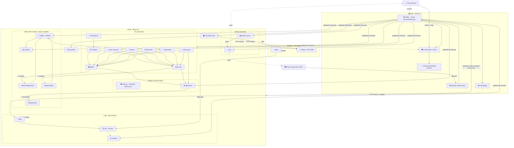

# 🛸 Homelab: Media, Automation & Local AI

[](https://github.com/Anwera64/homelab/actions/workflows/test.yml)
[](https://github.com/Anwera64/homelab/actions/workflows/household-hub-client.yml)
[](https://github.com/Anwera64/homelab/actions/workflows/caddy-image.yml)

A three-host homelab. **lemonpi**, an always-on Raspberry Pi, runs the house network services: DNS and DHCP, the HTTPS entry point, the dashboard and remote access. **The server**, an always-on laptop, runs everything else except the chat model: the Household Hub, the logs and all the media services. **The desktop** (Windows + Docker Desktop, RTX 5080) runs only Ollama, the chat model, and a log shipper. When the desktop is off, everything works except the Hub's chat model.

---

## 🖥️ Hosts

| Host | Address | Always on | Runs | Config |
| :--- | :--- | :--- | :--- | :--- |
| **lemonpi** (Raspberry Pi 5, 1 GB, wired) | `192.168.1.35` · `lemonpi.lan` | Yes | Pi-hole (DNS, ad blocking, DHCP), Unbound (DNSSEC resolver), Caddy (HTTPS for `*.spicy-llama.duckdns.org`), Homepage (dashboard), Tailscale (subnet router) | [`hosts/pi/`](hosts/pi/README.md) |
| **Server** (Lenovo Legion laptop, Debian 13, Wi-Fi) | `192.168.1.30` · `server.lan` | Yes | Household Hub, SearXNG, an Ollama for the Hub's embedder (GTX 1660 Ti), Loki + Alloy + Grafana (all logs), Grafana's image renderer (on demand), Uptime Kuma + ntfy (uptime checks and their alerts), Renovate (hourly runs that open the version bump PRs), and a nightly update that applies the merged ones. The media services: Jellyfin (NVENC), Seerr, Jellystat, Sonarr, Radarr, Prowlarr, Bazarr, Recyclarr, Maintainerr, Cleanuparr, and qBittorrent + FlareSolverr behind Gluetun (NordVPN WireGuard). Their files are on a USB media disk at `/data` | [`hosts/server/`](hosts/server/README.md) |
| **Desktop** (Windows, RTX 5080, Wi-Fi) | `192.168.1.20` · `desktop-kujo8mp.lan` | No | Ollama (the chat model, on the RTX 5080). Alloy ships its container logs to the server | [`hosts/desktop/`](hosts/desktop/README.md) |

All three addresses are DHCP reservations in Pi-hole (`PIHOLE_DHCP_HOSTS` in `hosts/pi/.env`). Elsewhere this README uses the `.lan` names (`lemonpi.lan`, `server.lan`, `desktop-kujo8mp.lan`), which Pi-hole resolves for every DHCP client.

---

## 🧭 Network Flow

* **DNS and DHCP:** the router (Orange Livebox 7) won't let you change the DNS it hands out, so its DHCP server is off and **Pi-hole serves DHCP**, naming itself as DNS. Pi-hole blocks ads and trackers, then resolves through **Unbound** straight from the root servers with DNSSEC. Unbound exempts `spicy-llama.duckdns.org` from DNS-rebinding protection, because that domain points at the LAN on purpose.
* **HTTPS:** `*.spicy-llama.duckdns.org` resolves to lemonpi. **Caddy on the Pi** holds a Let's Encrypt wildcard certificate (DuckDNS DNS challenge). It serves Homepage and Pi-hole itself, and forwards each service to the port its container publishes on the server. There's no reverse proxy on the server.
* **Remote access:** **Tailscale**. lemonpi advertises the home subnet (`192.168.1.0/24`) and is the tailnet's DNS, so phones get the same names, HTTPS and ad blocking away from home. No ports are forwarded to any service. At most, Tailscale's WireGuard UDP port (41641) is forwarded to the Pi, which helps direct connections but isn't required.
* **Desktop off:** only the chat model is unavailable, because it runs on the desktop's Ollama. DNS, DHCP, Homepage, Pi-hole, remote access, the rest of the Hub, the media services and the logs keep working, because they are on the server.
* **Server off:** DNS, DHCP and remote access keep working. The server's names return a 502 from the Pi's Caddy until it is back, and no alert is sent while it is down, because Uptime Kuma and ntfy run on it.


```mermaid
graph TD
    CLIENTS[📱 Home devices] -->|DHCP + DNS| PIHOLE
    REMOTE[🌍 Phones away from home] -->|Tailscale| TS

    subgraph Pi [lemonpi - always on]
        TS[🔒 Tailscale subnet router]
        PIHOLE[🛡️ Pi-hole DNS · DHCP] --> UNBOUND[🔁 Unbound DNSSEC resolver]
        CADDY[🔒 Caddy · *.spicy-llama.duckdns.org]
        CADDY --> HOMEPAGE[📊 Homepage]
        CADDY --> PIHOLE
    end

    CLIENTS -->|HTTPS| CADDY
    TS --> CADDY

    subgraph Server [server - always on]
        HUB[🏠 Household Hub]
        HUB --> SEARX[🔍 SearXNG]

        subgraph Logs [Logs - kept 30 days]
            ALLOY[🚚 Alloy] --> LOKI[🗄️ Loki · 30 days] --> GRAFANA[📈 Grafana]
        end

        subgraph Uptime [Uptime and alerts]
            KUMA[📟 Uptime Kuma] -->|alerts| NTFY[🔔 ntfy]
        end

        subgraph VPNNet [Gluetun VPN kill-switch]
            GLUETUN[🛡️ Gluetun · NordVPN WireGuard]
            QBIT[📥 qBittorrent]
        end

        subgraph ArrSuite [Arr automation]
            PROW[🔍 Prowlarr] --> RAD[🎬 Radarr] & SON[📺 Sonarr]
            FLARE[⚡ FlareSolverr] --> PROW
            SEERR[✨ Seerr requests] --> RAD & SON
            RAD & SON --> QBIT
            BAZ[📝 Bazarr] --> RAD & SON
            RECYC[♻️ Recyclarr] --> RAD & SON
            MAINT[🧹 Maintainerr] --> RAD & SON
            CLEAN[🧽 Cleanuparr] --> RAD & SON & QBIT
        end

        subgraph MediaStorage [Media disk at /data - atomic hardlinks]
            QBIT -->|1. Downloads| DOWN["/data/torrents"]
            RAD -->|2. Hardlink| MOVIES["/data/media/movies"]
            SON -->|2. Hardlink| SHOWS["/data/media/tv"]
            MOVIES & SHOWS --> JELLY[🍿 Jellyfin · NVENC]
            JELLY --> JSTAT[📊 Jellystat]
            JELLY --> MAINT
        end
    end

    subgraph Desktop [Desktop - RTX 5080]
        DALLOY[🚚 Alloy]
        OLLAMA[🦙 Ollama · RTX 5080]
    end

    HUB -->|LAN| OLLAMA
    DALLOY[🚚 Alloy] -->|ships logs| LOKI
    CADDY -->|published LAN ports| JELLY & SEERR & ArrSuite & QBIT & JSTAT & HUB & GRAFANA & KUMA & NTFY
    HOMEPAGE -.->|HTTP checks + widgets| Server
    Server -.->|Docker socket| ALLOY
    Desktop -.->|Docker socket| DALLOY
    CADDY -->|telemetry, token checked by the hub| ALLOY
    KUMA -.->|HTTP checks| PIHOLE & OLLAMA
    NTFY -.->|push| CLIENTS & REMOTE
```

---

## 🌐 Service Endpoints

| Service | Host | HTTPS (home + Tailscale) | Role |
| :--- | :--- | :--- | :--- |
| **Homepage** | lemonpi | `https://home.spicy-llama.duckdns.org` | Dashboard: HTTP checks for the server's services, Docker status for the Pi's |
| **Pi-hole** | lemonpi | `https://pihole.spicy-llama.duckdns.org/admin` | DNS, ad blocking and DHCP |
| **Jellyfin** | Server | `https://jellyfin.spicy-llama.duckdns.org` | NVENC transcoding on the server |
| **Seerr** | Server | `https://seerr.spicy-llama.duckdns.org` | Request & discovery portal |
| **Jellystat** | Server | `https://stat.spicy-llama.duckdns.org` | Playback analytics |
| **qBittorrent** | Server | `https://qbit.spicy-llama.duckdns.org` | Download client (VueTorrent), published through Gluetun |
| **Sonarr** | Server | `https://sonarr.spicy-llama.duckdns.org` | TV series |
| **Radarr** | Server | `https://radarr.spicy-llama.duckdns.org` | Movies |
| **Prowlarr** | Server | `https://prowlarr.spicy-llama.duckdns.org` | Indexer proxy |
| **Bazarr** | Server | `https://bazarr.spicy-llama.duckdns.org` | Subtitles |
| **Maintainerr** | Server | `https://maintainerr.spicy-llama.duckdns.org` | Media lifecycle & cleanup |
| **Cleanuparr** | Server | `https://cleanuparr.spicy-llama.duckdns.org` | Download queue cleanup: fakes, failed imports, seeding limits |
| **FlareSolverr** | Server | — | Cloudflare challenge solver. No login, so no name and no port: only Prowlarr reaches it |
| **Household Hub** | Server | `https://hub.spicy-llama.duckdns.org` | Family assistant backend (`/docs` at `http://127.0.0.1:3050` on the server itself) |
| **Grafana** | Server | `https://grafana.spicy-llama.duckdns.org` | Log search (sign-in required) |
| **Uptime Kuma** | Server | `https://uptime.spicy-llama.duckdns.org` | Uptime checks and their history (sign-in required) |
| **ntfy** | Server | `https://ntfy.spicy-llama.duckdns.org` | Pushes Uptime Kuma's alerts to the phones (sign-in required) |
| **Gluetun API** | Server | — | VPN status for Homepage (port 8000, API key) |
| **SearXNG** | Server | — | Private search for the hub (internal `http://searxng:8080`) |
| **Ollama** | Desktop | — | The chat model, local LLM inference (port 11434, the server only) |
| **Ollama (embedder)** | Server | — | `bge-m3`, ranks what a chat turn reads (internal `http://ollama:11434`) |
| **Loki** | Server | — | Log store, 30 days (port 3100, the desktop's Alloy only) |
| **Alloy** | Server | `https://telemetry.spicy-llama.duckdns.org` | Ships the server's container output to Loki; receives the app's logs (OTLP), after the hub has checked the sender's token |
| **Alloy** | Desktop | — | Ships the desktop's container output to the server's Loki |
| **Recyclarr** | Server | — | TRaSH Guides sync, daily 3 AM |
| **Renovate** | Server | — | Version bump PRs for every host's images, the hub and its client, weekly; runs every hour |
| **Nightly update** | Server | — | Applies merged bumps and restarts the stack, daily 4 AM |

The server has a firewall, so its service ports answer lemonpi only.

---

## 📁 Repository Structure

```
.
├── .github/
│   └── workflows/
│       ├── test.yml                 # CI: node tests + compose validation
│       ├── household-hub-client.yml # CI: hub client (Kotlin Multiplatform)
│       ├── household-hub-backend.yml # CI: hub backend tests (pytest), lock files and image build
│       └── caddy-image.yml          # Builds the Pi's Caddy + DuckDNS image (arm64/amd64) to GHCR
├── renovate.json                    # Renovate: weekly bump PRs for pinned images and the hub's and client's libraries
├── .githooks/
│   └── pre-commit                   # Tests, compose validation, architecture checks before every commit
├── AGENTS.md                        # Development rules (plan first, TDD, Clean Architecture, environment)
├── ROADMAP.md                       # Roadmap
├── hosts/
│   ├── pi/                          # lemonpi, checked out alone on the Pi (sparse clone)
│   │   ├── README.md                # Pi setup, DHCP switch-over, checks, backups
│   │   ├── bootstrap.sh             # Idempotent setup: OS, log2ram, Docker, Tailscale, stack
│   │   ├── docker-compose.yml       # Pi-hole, Unbound, Caddy, Homepage
│   │   ├── .env.example             # Pi secrets template (password, DuckDNS token, leases, API keys)
│   │   ├── caddy/
│   │   │   ├── Caddyfile            # HTTPS routes for *.spicy-llama.duckdns.org
│   │   │   └── Dockerfile           # Caddy + DuckDNS DNS plugin (built by CI)
│   │   └── unbound/
│   │       └── unbound.conf         # Recursive DNSSEC resolver on 127.0.0.1:5335
│   ├── desktop/                     # The Windows PC: the chat model (Ollama) and its log shipper
│   │   ├── README.md                # Setup, PATH, firewall, updating
│   │   ├── docker-compose.yml       # Ollama and Alloy
│   │   ├── .env.example             # Desktop settings template
│   │   ├── startup_homelab.ps1      # Start the stack and register the models
│   │   ├── stop_homelab.ps1         # Stop the stack
│   │   ├── compact_docker_disk.ps1  # Shrink Docker virtual disk
│   │   └── enable_virtualization.ps1 # Hyper-V / WSL2 setup helper
│   └── server/                      # The always-on app server (laptop): everything but the chat model
│       ├── README.md                # Install, bootstrap, firewall, media disk, moving hardware
│       ├── bootstrap.sh             # Idempotent setup: NVIDIA, Docker, SSH, firewall, disk guard, stack
│       ├── docker-compose.yml       # The media services, the Hub, the logs and the embedder, with memory caps
│       ├── .env.example             # Server settings template (paths, allowed addresses, secrets)
│       └── system/                  # Firewall, disk guard, battery, nightly update and Renovate scripts with their units
├── apps/
│   └── household-hub/               # Household Hub: backend (FastAPI) and client (KMP)
├── config/
│   ├── homepage/                    # Homepage config, served from the Pi
│   │   ├── services.yaml            # Services, widgets and HTTP checks
│   │   ├── custom.js                # GPS weather badge in the header
│   │   ├── custom.css               # Styling overrides
│   │   ├── settings.yaml            # Layout
│   │   ├── widgets.yaml             # Header widgets
│   │   ├── bookmarks.yaml           # Bookmarks
│   │   └── docker.yaml              # Docker socket (the Pi's own containers)
│   ├── ollama-models/               # Tracked Modelfiles and the model manifest
│   ├── searxng/
│   │   └── settings.yml             # SearXNG engines and JSON API
│   ├── loki/
│   │   └── loki-config.yaml         # Loki: filesystem storage, 30-day retention, rate limits
│   ├── alloy/
│   │   └── config.alloy             # Alloy: Docker socket -> Loki, logs=off opt-out (shared by server and desktop)
│   └── grafana/
│       └── provisioning/
│           └── datasources/
│               └── loki.yaml        # Loki as Grafana's data source
└── tests/
    ├── service-ports.js             # The port each service publishes, shared by the suites
    ├── homepage-custom.test.js      # Homepage's custom.js and its https:// links
    ├── config-integrity.test.js     # Compose files, Homepage and env cross-checks
    ├── pi-dns.test.js               # Pi compose, Unbound, DHCP and bootstrap.sh
    ├── pi-caddy.test.js             # Pi Caddy routes and the image workflow
    ├── server-stack.test.js         # Server compose, env template, CI gates and server README
    ├── server-bootstrap.test.js     # Server bootstrap.sh, firewall, disk guard, battery and nightly update
    ├── renovate.test.js             # Renovate's groups, auto-merge rules and tag schemes
    ├── backend-workflow.test.js     # Hub backend CI workflow
    ├── ci-workflow.test.js          # Hub client CI workflow
    ├── scripts-validation.test.js   # PowerShell scripts
    └── readme.test.js               # This README matches the repo
```

---

## 🚀 Setup

### lemonpi
See [`hosts/pi/README.md`](hosts/pi/README.md): a sparse clone of `hosts/pi` (plus `config/homepage`), then `sudo hosts/pi/bootstrap.sh`. It covers the DHCP switch-over from the Livebox, Tailscale, and pointing DuckDNS at the Pi.

### Server
See [`hosts/server/README.md`](hosts/server/README.md): a Debian 13 install on the laptop, then `sudo hosts/server/bootstrap.sh`. It runs the Household Hub, the logs and the media services.

### Desktop
Prerequisites: Docker Desktop (WSL2 backend), the NVIDIA Container Toolkit (GPU access for Ollama), and Node.js 18+ (tests).

```powershell
git clone git@github.com:Anwera64/homelab.git
cd homelab
git config core.hooksPath .githooks
```

Then see [`hosts/desktop/README.md`](hosts/desktop/README.md) for the settings file, the PATH entry and the firewall.

The Windows network profile is **Private**. Ollama is published for the server's Hub alone, with a rule that names the server's address:
```powershell
New-NetFirewallRule -DisplayName "Homelab Ollama (server)" -Direction Inbound -Protocol TCP -LocalPort 11434 -RemoteAddress 192.168.1.30 -Action Allow
```
The old media rule is no longer needed. Remove it from an admin PowerShell:
```powershell
Remove-NetFirewallRule -DisplayName "Homelab Stack (LAN)"
```

---

## 🛠️ Operations

**Desktop**
* **Start:** `startup_homelab.ps1`, from any folder (`hosts\desktop` is on the PATH). It takes no flags. It checks Docker and starts Docker Desktop if needed, creates `.env` from `.env.example` on the first run, runs `docker compose up -d` and reports failed containers. It also downloads, SHA256-checks and registers the models in `config/ollama-models/models.json` that Ollama is missing.
* **Stop:** `stop_homelab.ps1`
* **Updates:** Renovate pins the two images; after a bump is merged, run `git pull` and then `startup_homelab.ps1`.
* **Ollama models:** they live in the `ollama_models` Docker volume. Keys stay in `config/ollama`, and the tracked Modelfiles in `config/ollama-models`.
* **Switching the chat model:** add it to `config/ollama-models/models.json` (GGUF URL, SHA256, Modelfile), set `DEFAULT_LLM_MODEL` for the hub in `hosts/server/.env`, and restart both.
* **Reclaim disk after removing models or images** (admin): `compact_docker_disk.ps1`
* **Recent lines:** `docker compose logs -f <service>` still works. Docker's own copy is capped at 10 MB x 3 files per container.

**Server**
* **Update:** `cd ~/homelab && git pull && sudo hosts/server/bootstrap.sh`
* **Logs:** every container's output is kept for 30 days in Loki and survives a rebuild. This covers the server's containers and the desktop's.
* **Searching logs:** open Grafana (Explore) at `https://grafana.spicy-llama.duckdns.org`. Try `{container="household-hub"}`, or `{container="household-hub"} |= "tool"` to filter by text. The desktop's lines carry `host="desktop"`: `{host="desktop", container="ollama"}`.
* **Grafana sign-in:** admin / admin on first start (Grafana asks for a new password), or `GRAFANA_ADMIN_PASSWORD` in `hosts/server/.env`.
* **Leave a container out:** label it `logs=off`.
* **Dashboards as images:** Grafana can draw a dashboard or a panel as a PNG, which is how a dashboard change gets checked without a browser. The renderer is a headless browser and does not run by itself. On the server, in `~/homelab/hosts/server`, start it with `docker compose --profile render up -d grafana-renderer` and stop it with `docker compose --profile render stop grafana-renderer`.
* **The app's logs:** `{service_name="household-hub-app"}`, or add `member_id="..."` for one member. The app posts them to `https://telemetry.spicy-llama.duckdns.org/v1/logs` with its sign-in token; Caddy asks the hub whose token it is before passing them to Alloy.
* **Privacy:** the hub's lines carry calendar titles and note text (secret chats are left out). They are kept for 30 days behind Grafana's sign-in, and Loki's port is open to the desktop's Alloy only.

**lemonpi**
* **Update:** `cd ~/homelab && git pull && sudo hosts/pi/bootstrap.sh`. Image versions are pinned in `hosts/pi/docker-compose.yml`; Renovate opens the bump PRs.
* **Caddy image:** CI builds it monthly and on changes to `hosts/pi/caddy/Dockerfile`. Bump the pinned tag to roll it out.
* **Checks, backups and rollback:** see [`hosts/pi/README.md`](hosts/pi/README.md).

**Tests:** `node --test`

---

## 🍿 Streaming Notes

Jellyfin on the server uses **NVIDIA NVENC/NVDEC** (GTX 1660 Ti) for transcoding and HDR tone mapping. The GPU encodes H.264 and HEVC. It cannot encode AV1:

* **At home:** clients direct-play full 4K HDR remuxes (80–100+ Mbps) without transcoding.
* **Away:** the server caps remote streams at **40 Mbps**. With the client quality on **Auto**, the player picks a transcode tier to fit the connection, and the GPU does the transcoding.

Recommended client settings: bitrate **Auto**, and **ExoPlayer** on Android / Google TV.

---

## 🧪 Quality Gate

* **Tests (`node --test`):** about 190 checks across nine suites (see `tests/` above). They keep the compose files, the Pi's Caddyfile, Homepage, the scripts, the workflows and this README consistent with each other.
* **Pre-commit hook (`.githooks/pre-commit`):**
  * the test suite
  * `docker compose config` for the desktop, Pi and server stacks
  * the hub backend's Clean Architecture boundary tests
  * for hub client changes, ktlint and the architecture tests
* **CI (`.github/workflows/`):**
  * the tests and compose validation on every push and PR
  * the hub client build
  * the Pi's Caddy image build

---

## 📄 Acknowledgments

[Pi-hole](https://pi-hole.net/) · [Unbound](https://nlnetlabs.nl/projects/unbound/) · [Caddy](https://caddyserver.com/) · [Homepage](https://gethomepage.dev/) · [Tailscale](https://tailscale.com/) · [Jellyfin](https://jellyfin.org/) · [LinuxServer.io](https://www.linuxserver.io/) · [VueTorrent](https://github.com/VueTorrent/VueTorrent) · [TRaSH Guides](https://trash-guides.info/) · [Gluetun](https://github.com/qdm12/gluetun) · [Ollama](https://ollama.com/) · [SearXNG](https://searxng.org/) · [Grafana](https://grafana.com/) · [Loki](https://grafana.com/oss/loki/) · [Alloy](https://grafana.com/oss/alloy-opentelemetry-collector/) · [Uptime Kuma](https://github.com/louislam/uptime-kuma) · [ntfy](https://ntfy.sh/)
