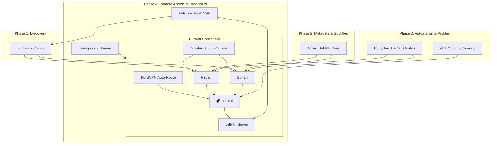

# 🚀 Homelab Media Stack Roadmap & Master Plan

This document serves as the persistent architectural roadmap for your self-hosted streaming and automation setup.

---

## 📌 Current Baseline Setup

| Component | Role | Details |
| :--- | :--- | :--- |
| **Prowlarr** | Indexer Proxy | Public trackers (TorrentGalaxy, 1337x, BitSearch, Knaben, ShowRSS) + FlareSolverr |
| **Sonarr** | TV Automation | Series monitoring, custom Latin American audio formatting |
| **Radarr** | Movie Automation | Film monitoring, Extended/Special Edition scoring rules |
| **qBittorrent** | Download Client | Bound to `NordLynx` network adapter (Kill-Switch active) |
| **Jellyfin** | Media Server | Windows Tray app with local Direct Play streaming |
| **FlareSolverr** | Cloudflare Bypass | Standalone binary running on port 8191 |
| **NordVPN** | Network Security | CLI auto-connect with route-table verification |
| **Control Scripts** | On-Demand Power | [`startup_homelab.ps1`](./startup_homelab.ps1) & [`stop_homelab.ps1`](./stop_homelab.ps1) |

---

## 🗺️ Phased Upgrade Roadmap



---

## Phase 1: Request & Discovery UI (High Priority)
* **Tool:** **Jellyseerr** (or Overseerr)
* **Objective:** Replace manual Radarr/Sonarr navigation with a single Netflix-style interface for discovering and requesting titles.
* **Key Tasks:**
  - [ ] Install Jellyseerr (Windows binary or lightweight container).
  - [ ] Connect Jellyseerr to Jellyfin user accounts.
  - [ ] Link Jellyseerr API to Radarr and Sonarr instances.
  - [ ] Add to [`startup_homelab.ps1`](./startup_homelab.ps1) and [`stop_homelab.ps1`](./stop_homelab.ps1).

---

## Phase 2: Automated Subtitles
* **Tool:** **Bazarr**
* **Objective:** Eliminate missing subtitles by automatically downloading and synchronizing subtitle tracks in preferred languages.
* **Key Tasks:**
  - [ ] Install Bazarr for Windows.
  - [ ] Configure subtitle providers (OpenSubtitles.com with API key, Subdl, Podnapisi).
  - [ ] Set language profile priority: Latin American Spanish (`es-MX` / `es-419`) & English.
  - [ ] Enable auto-sync / audio-offset alignment.
  - [ ] Add Bazarr to startup/stop scripts.

---

## Phase 3: Quality Profiles & Torrent Cleanup
* **Tools:** **Recyclarr** & **qBit-Manage**
* **Objective:** Keep file sizes optimal, audio tracks standardized, and storage clean of dead torrents.
* **Key Tasks:**
  - [ ] **Recyclarr**:
    - [ ] Set up `recyclarr.yml` to automatically sync TRaSH Guides.
    - [ ] Import standard profiles (HD-1080p, 4K UHD, Audio/Codec tier lists, unwanted release group blocks).
  - [ ] **qBit-Manage**:
    - [ ] Configure automatic removal of stalled/dead seeds (0 seeder threshold).
    - [ ] Set auto-categorization and orphan file cleanup.

---

## Phase 4: Library Transcoding & Optimization
* **Tool:** **Unmanic** (or Tdarr)
* **Objective:** Re-encode legacy or bloated files (H.264, MPEG-2, VC-1) into modern **x265 / HEVC 10-bit** in the background, reclaiming 40–60% disk storage without losing perceived quality.
* **Key Tasks:**
  - [ ] Deploy Unmanic with hardware acceleration (NVENC / QuickSync / AMD AMF).
  - [ ] Set up library watch folders for completed movies and series.

---

## Phase 5: Secure Remote Access
* **Tool:** **Tailscale**
* **Objective:** Stream your Jellyfin library or request media from your phone/laptop outside your home without port forwarding on your router.
* **Key Tasks:**
  - [ ] Install Tailscale on the host PC.
  - [ ] Install Tailscale app on mobile/client devices.
  - [ ] Access Jellyfin directly via secure MagicDNS / Tailscale IP (e.g. `http://homelab:8096`).

---

## Phase 6: Unified Dashboard & Analytics
* **Tools:** **Homepage** (or Homarr) & **Jellystat**
* **Objective:** Single-pane-of-glass dashboard for monitoring speeds, active streams, and server health.
* **Key Tasks:**
  - [ ] Configure `services.yaml` and `widgets.yaml` in Homepage.
  - [ ] Display live qBittorrent download rates, Jellyfin active sessions, and disk capacity.
  - [ ] Connect Jellystat to log watch time and transcoding metrics.

---

## 🛠️ Script Maintenance Quick Reference

* **Start Everything:**
  ```powershell
  .\startup_homelab.ps1
  ```
  *(Checks NordVPN route, launches minimized Arr apps, Jellyfin Tray, and FlareSolverr).*

* **Stop Everything:**
  ```powershell
  .\stop_homelab.ps1
  ```
  *(Auto-elevates to Administrator, stops Windows services, and cleanly terminates all media processes & tray apps).*
