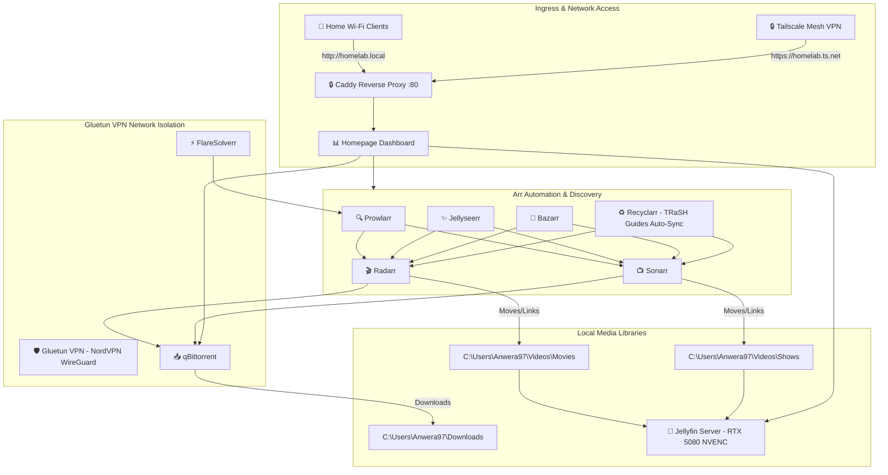

# 🚀 Homelab Media Stack Roadmap & Master Plan

This document serves as the persistent architectural roadmap for your self-hosted streaming and automation setup.

---

## 📌 Architecture Overview (Docker Compose Architecture)

| Component | Role | Details |
| :--- | :--- | :--- |
| **Caddy** | Reverse Proxy | Port 80/443 ingress, routing `homelab.local` & subdomains |
| **Gluetun** | VPN Gateway | NordVPN WireGuard (NordLynx) tunnel with automatic kill-switch |
| **qBittorrent** | Download Client | Routed strictly through Gluetun container network |
| **FlareSolverr** | Cloudflare Bypass | Routed strictly through Gluetun container network |
| **Prowlarr** | Indexer Proxy | Public trackers (TorrentGalaxy, 1337x, BitSearch, Knaben, ShowRSS) |
| **Sonarr** | TV Automation | Series monitoring, custom Latin American audio formatting |
| **Radarr** | Movie Automation | Film monitoring, Extended/Special Edition scoring rules |
| **Bazarr** | Subtitles | Automated subtitle download and audio-offset sync |
| **Jellyseerr** | Request & Discovery | Netflix-style search & request interface |
| **Jellyfin** | Media Server | Hardware-accelerated (NVIDIA RTX 5080 NVENC/NVDEC) |
| **Homepage** | Unified Dashboard | Single-pane-of-glass status and telemetry |
| **Tailscale** | Remote Mesh VPN | Secure, encrypted zero-port-forwarding remote access |
| **Control Scripts** | Orchestration | [`startup_homelab.ps1`](./startup_homelab.ps1) & [`stop_homelab.ps1`](./stop_homelab.ps1) |

---

## 🗺️ Stack Relationship Diagram



---

## 🛠️ Management & Quick Reference

* **Start Entire Stack:**
  ```powershell
  .\startup_homelab.ps1
  # or: docker compose up -d
  ```

* **Stop Entire Stack:**
  ```powershell
  .\stop_homelab.ps1
  # or: docker compose down
  ```

* **Update All Services:**
  ```powershell
  docker compose pull && docker compose up -d
  ```

* **View Service Logs:**
  ```powershell
  docker compose logs -f <service-name>
  ```

---

## 🌐 Web UI Service Endpoints

| Service | Primary Hostname (Port 80) | Direct / Network Endpoint | Notes |
| :--- | :--- | :--- | :--- |
| **Homepage (Remote)** | [https://homelab.llama-porbeagle.ts.net](https://homelab.llama-porbeagle.ts.net) | Tailscale MagicDNS | Secure remote portal (Let's Encrypt HTTPS) |
| **Homepage Portal** | [http://desktop-kujo8mp](http://desktop-kujo8mp) | [http://192.168.1.20](http://192.168.1.20) | Central dashboard & status |
| **Jellyfin** | [http://desktop-kujo8mp:8096](http://desktop-kujo8mp:8096) | [http://localhost:8096](http://localhost:8096) | Media server (RTX 5080 NVENC) |
| **Jellyseerr** | [http://desktop-kujo8mp:5055](http://desktop-kujo8mp:5055) | [http://localhost:5055](http://localhost:5055) | Media discovery & requests |
| **qBittorrent** | [http://desktop-kujo8mp:8080](http://desktop-kujo8mp:8080) | [http://localhost:8080](http://localhost:8080) | Routed via Gluetun VPN |
| **Radarr** | [http://desktop-kujo8mp:7878](http://desktop-kujo8mp:7878) | [http://localhost:7878](http://localhost:7878) | Movies manager |
| **Sonarr** | [http://desktop-kujo8mp:8989](http://desktop-kujo8mp:8989) | [http://localhost:8989](http://localhost:8989) | TV series manager |
| **Prowlarr** | [http://desktop-kujo8mp:9696](http://desktop-kujo8mp:9696) | [http://localhost:9696](http://localhost:9696) | Indexers manager |
| **Bazarr** | [http://desktop-kujo8mp:6767](http://desktop-kujo8mp:6767) | [http://localhost:6767](http://localhost:6767) | Subtitles manager |
| **Recyclarr** | Container (Cron `0 3 * * *`) | N/A | TRaSH Guides quality & format sync |
| **FlareSolverr** | Container | [http://localhost:8191](http://localhost:8191) | Cloudflare bypass API |

