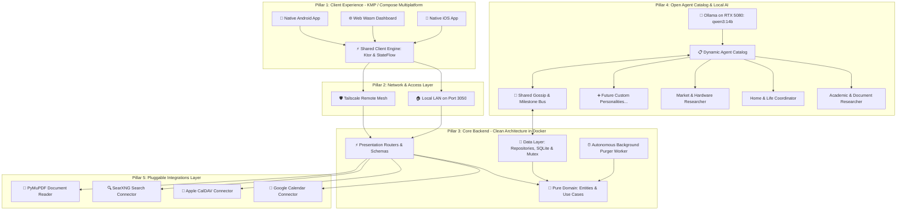

# Household Hub: High-Level System Architecture Plan

A high-level architectural blueprint for the **Household Hub** platform. This document establishes the system boundaries, design principles, core modules, and the component roadmap. It intentionally remains at an architectural level; detailed implementation plans for individual components will be created one at a time as we reach each stage.

---

## 1. System Vision & Design Principles

* **User Autonomy & Decoupled Spaces:**
  * Users are not bound to predetermined roles or fixed tools.
  * **Personal Spaces:** Each user has their own private space where they can pin widgets, connect their own accounts, configure personal feeds, and converse privately with any agent.
  * **Shared Household Space:** A collaborative area where members view merged schedules, shared household notices, joint dinner/recipe suggestions, and daily morning briefings.
* **Modular & Dynamic Agent Catalog:**
  * Agents are not hardcoded classes. They are **dynamic, modular personalities** that can be created, configured, tuned, or deactivated at any time.
  * Any user can initiate a conversation with any agent from the catalog.
  * Over time, the household can add new specialized personalities (e.g. academic research, financial planning, home DIY, fitness) or retire unused ones without modifying system code.
* **Attributed & Directional "Gossip" Bus:**
  * The gossip bus is not an aimless broadcast; it is a **user-attributed, directional context stream**.
  * Every published insight or milestone carries explicit provenance: `source_user`, `reporting_agent`, `target_context` (Household or specific user), and the milestone payload.
  * Agents maintain strict **relational awareness**: an agent knows who it is speaking with and attributes information transparently (e.g., *"User A mentioned to the Academic Researcher that her UPC Studio Jury is Friday..."*).
* **Confidentiality & "Secret Mode" (Zero-Leak Privacy):**
  * Users must have total control over what is shared (e.g., planning a surprise anniversary dinner, researching a birthday gift, or personal health/thoughts).
  * **Session-Level Secret Mode:** A toggle in any conversation that completely severs the Gossip Bus. In Secret Mode, the agent is hard-blocked from emitting any shared milestones or facts.
  * **Natural Language Privacy Guard:** Saying *"Keep this between us"*, *"This is a secret"*, or *"Don't tell [User B]"* automatically enforces confidentiality.
  * **Audit & Revoke:** Users have an audit view of any milestones their conversations have published to the household bus, with one-click revocation/deletion.
* **Persistent Agent Memory & Dynamic Relationship Building:**
  * Agents build cumulative, long-term relationships with household members over time rather than treating interactions as amnesiac one-offs.
  * **Dynamic Autonomous Extraction (Stage 3):** During conversations, agents autonomously extract user preferences, dietary habits, ongoing projects, and milestones into structured long-term memory.
  * **Dynamic Context Injection (Stage 3):** At session start, relevant memories are dynamically retrieved and injected into the agent's prompt context, greeting users with immediate relational awareness.
  * **Two-Tier Memory Scoping:** Personal memories (`scope="personal"`) are strictly isolated to the user under Zero-Leak rules; household facts (`scope="household"`) carry user attribution.
  * **Human-in-the-Loop "Glass Box" Control:** Users maintain full control via an audit screen to inspect, refine, or delete/revoke any memory an agent has formed.
* **Pluggable Integrations Engine:**
  * Extensible connectors for external services (Google Calendar, Apple iCloud CalDAV, SearXNG private search, PDF/document extractors).
  * Users attach whichever accounts or tools they personally use.
* **Model-Agnostic with a Single Initial Baseline (`qwen3:14b`):**
  * **Unified Initial Baseline:** We standardize exclusively on **`qwen3:14b`** for all initial agents and tasks (everyday coordination, academic research, tool execution, and the gossip bus). This keeps the starting setup lean, predictable, and fully fitted within the RTX 5080's VRAM budget with large context headroom.
  * **Evolution-Ready Abstraction:** The backend accesses `qwen3:14b` via standard OpenAI-compatible endpoints (`/v1/chat/completions`) using logical aliases. When newer models or hardware upgrades are introduced later, swapping or adding models will be a 1-click configuration change with zero code refactoring.
* **Polyglot Homelab Architecture:**
  * **Client:** Kotlin Multiplatform (Compose Multiplatform) targeting Android, Web (Wasm), and iOS.
  * **Backend:** Python (FastAPI) running in Docker on your homelab server.
  * **Intelligence:** Local **NVIDIA RTX 5080 (Ollama: `qwen3:14b`)**.
  * **Networking:** Direct LAN access at home; encrypted **Tailscale** mesh for remote access (from UPC Barcelona or on mobile).

---

## 2. High-Level Architecture Diagram



---

## 3. High-Level System Pillars

### Pillar 1: Client Experience (Compose Multiplatform)
* Multiplatform presentation layer sharing core networking, serialization, and ViewModels.
* Responsive layouts tailored for desktop screens, mobile devices, and shared kitchen displays.
* Seamless switching between personal views and the shared household hub.

### Pillar 2: Core Backend & Spaces Engine (FastAPI)
* **Clean Architecture Design:** Strict inward dependency structure (`presentation -> domain <- data`) coordinated by a centralized async `bootstrap` dependency injection container.
* **Pure Domain Core:** Business logic, use cases, and entities have zero dependencies on web frameworks, databases, or outside serialization libraries.
* **Identity & Access Control:** Multi-user authentication, long-lived JWT sessions, distributed mutex onboarding lock, and role-based permissions.
* **Zero-Leak Spaces Engine:** Manages isolated data persistence for personal workspaces and the shared household space.
* **Autonomous Background Maintenance:** Continuous `lifespan` asyncio workers handling autonomous trash purges and data hygiene.
* **Real-Time Delivery:** Exposes standardized REST and Server-Sent Events (SSE) for real-time agent streaming.

### Pillar 3: Open Agent Catalog & Gossip Bus
* **Data-driven agent registry:** Manages agent definitions, system prompts, tool permissions, and model parameters.
* **Unified Baseline Model (`qwen3:14b`):** Standardizes exclusively on local `qwen3:14b` (Ollama on RTX 5080) for all initial agent workflows, while routing through an OpenAI-compatible abstraction to enable seamless evolution to other models later.
* **Attributed Gossip Bus:** Directional event stream where shared milestones carry explicit user attribution (`source_user` $\rightarrow$ `target_scope`), enabling agents to refer naturally to who said what and who has upcoming constraints.
* **Privacy Governance & Secret Mode:** Hardware-enforced confidentiality toggles and prompt safety barriers ensuring surprise gifts, sensitive notes, or private conversations never reach the Gossip Bus.

### Pillar 4: Pluggable Integrations
* Connector framework that standardizes external services:
  * Calendar feeds (Google Calendar API, Apple iCloud CalDAV, standard CalDAV).
  * Web research & search (local SearXNG container).
  * Academic & architectural document processing (PyMuPDF for complex paper layouts).

---

## 4. Staged Component Roadmap

We will proceed through the build in modular, sequential stages. Before touching any code in a stage, we will write a dedicated, reviewable component plan:

```
[Stage 1: Backend Foundation, Spaces & Dynamic Agent Catalog]
                             │
                             ▼
[Stage 2: Pluggable Integrations Engine (Calendars, Search, PDF)]
                             │
                             ▼
[Stage 3: AI Inference, Tool Execution & Gossip Bus]
                             │
                             ▼
[Stage 4: KMP Shared Client Core (:shared)]
                             │
                             ▼
[Stage 5: Compose Multiplatform UI (:composeApp)]
                             │
                             ▼
[Stage 6: Homelab Deployment & Tailscale Ingress]
```

1. **Stage 1: Backend Foundation, Spaces, Dynamic Agent Catalog & Memory Engine** `[COMPLETED ✅]`
   * Core FastAPI service following Clean Architecture (`presentation -> domain <- data`, `bootstrap` DI), multi-user identity (first-run onboarding with distributed mutex & admin provisioning), strict zero-leak personal & shared space data models with Bento widgets, dynamic agent catalog with 2 baseline models (`researcher`, `assistant`), ownership permissions with 7-day undo grace period, autonomous background purger, inactive agent suspension, cascading session archival, and long-term memory engine with user audit/revoke. 70 automated tests (100% pass) with AST boundary enforcement.
   * Documented baseline: [`docs/STAGE_1_BASELINE.md`](./docs/STAGE_1_BASELINE.md)
2. **Stage 2: Pluggable Integrations Engine** `[COMPLETED ✅]`
   * Pluggable CalDAV calendar integration (Apple iCloud, Google Calendar, self-hosted) with Fernet AES-256 encrypted credentials, atomic in-place updates, SSRF prevention, and graceful token recovery; SearXNG private search client with persistent connection pooling, bounded LRU caching (max 500 entries), and freshness bypass; PyMuPDF structured document reader with chunked streaming upload validation (64KB chunks) and scanned PDF rejection; SQLite document store with versioning and Markdown export; zero-trust mandatory session binding and server-authoritative Secret Mode external tool lock; uniform tool execution dispatcher. 107 automated tests (100% pass) with AST boundary enforcement.
   * Documented baseline: [`docs/STAGE_2_BASELINE.md`](./docs/STAGE_2_BASELINE.md)
3. **Stage 3: AI Inference, Tool Execution, Autonomous Memory & Gossip Bus** `[COMPLETED ✅]`
   * Local Ollama inference integration (`qwen3:14b` on RTX 5080) via OpenAI-compatible endpoints with progressive token-by-token SSE streaming (`execute_stream`); agent tool execution loop; context assembly with prompt injection delimiter stripping; autonomous memory reflection with in-place semantic deduplication; attributed gossip bus with milestone sanitization; durable background stream execution resilient to client disconnects; synchronous session lock registry (`HTTP 409 Conflict`) with atomic pruning; upstream LLM exception mapping (`HTTP 502 Bad Gateway` / `HTTP 504 Gateway Timeout`); strict CORS origin lockdown (`https://spicy-llama.duckdns.org`) with DuckDNS subdomain regex. 157 automated tests (100% pass) with AST boundary enforcement.
   * Documented baseline: [`docs/STAGE_3_BASELINE.md`](./docs/STAGE_3_BASELINE.md)
4. **Stage 4: KMP Shared Client Core (`:shared`)** `[COMPLETED ✅]`
   * Multi-module Kotlin Multiplatform architecture (`:core:domain`, `:core:data`, `:core:presentation`, `:shared`) built with Kotlin 2.2+, Ktor 3.4.1, Koin 4.0, and AndroidX Lifecycle 2.8.4. Strict Clean Architecture boundary enforcement (`presentation -> domain <- data`, `:shared` DI coordinator).
   * Features preemptive Bearer auth auto-propagation, defensive SSE token streaming with prompt delimiter stripping, multiplatform disk-backed `FileTokenStorage` surviving process death, portable `NetworkExceptionHelper` (zero `java.net.*` in `commonMain`), 409 conflict exponential backoff recovery with 60s timeout, 1-tap message retries, and collision-free monotonic nanosecond optimistic message tracking in `ChatSessionViewModel`.
   * 20 automated test suites with 100% pass rate, AST layer boundary verification, and Koin dependency graph validation.
   * Documented baseline: [`docs/STAGE_4_BASELINE.md`](./docs/STAGE_4_BASELINE.md)
5. **Stage 5: Compose Multiplatform UI (`:composeApp`)** `[NEXT UP ⏳]`
   * Compose Multiplatform screens (`:composeApp`), theme, dashboard navigation, streaming chat, and agent memory audit & management UI ("What I Know About You").
6. **Stage 6: Homelab Deployment & Tailscale Ingress**
   * Docker Compose integration, port bindings, and secure remote routing via Tailscale.
