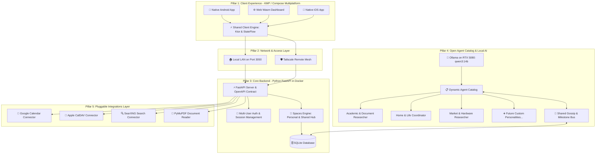

# Household Hub: High-Level System Architecture Plan

A high-level architectural blueprint for the **Household Hub** platform. This document establishes the system boundaries, design principles, core modules, and the component roadmap. It intentionally remains at an architectural level; detailed implementation plans for individual components will be created one at a time as we reach each stage.

---

## 1. System Vision & Design Principles

* **User Autonomy & Decoupled Spaces:**
  * Users are not bound to predetermined roles or fixed tools.
  * **Personal Spaces:** Each user has their own private space where they can pin widgets, connect their own accounts, configure personal feeds, and converse privately with any agent.
  * **Shared Household Space:** A collaborative area where members view merged schedules, shared household notices, joint dinner/recipe suggestions, and daily morning briefings.
* **Modular & Dynamic Agent Catalog:**
  * Agents are not hardcoded classes. They are **dynamic, modular personalities** that can be created, configured, tuned, or deactivated at any time.
  * Any user can initiate a conversation with any agent from the catalog.
  * Over time, the household can add new specialized personalities (e.g. academic research, financial planning, home DIY, fitness) or retire unused ones without modifying system code.
* **Attributed & Directional "Gossip" Bus:**
  * The gossip bus is not an aimless broadcast; it is a **user-attributed, directional context stream**.
  * Every published insight or milestone carries explicit provenance: `source_user`, `reporting_agent`, `target_context` (Household or specific user), and the milestone payload.
  * Agents maintain strict **relational awareness**: an agent knows who it is speaking with and attributes information transparently (e.g., *"User A mentioned to the Academic Researcher that her UPC Studio Jury is Friday..."*).
* **Confidentiality & "Secret Mode" (Zero-Leak Privacy):**
  * Users must have total control over what is shared (e.g., planning a surprise anniversary dinner, researching a birthday gift, or personal health/thoughts).
  * **Session-Level Secret Mode:** A toggle in any conversation that completely severs the Gossip Bus. In Secret Mode, the agent is hard-blocked from emitting any shared milestones or facts.
  * **Natural Language Privacy Guard:** Saying *"Keep this between us"*, *"This is a secret"*, or *"Don't tell [User B]"* automatically enforces confidentiality.
  * **Audit & Revoke:** Users have an audit view of any milestones their conversations have published to the household bus, with one-click revocation/deletion.
* **Pluggable Integrations Engine:**
  * Extensible connectors for external services (Google Calendar, Apple iCloud CalDAV, SearXNG private search, PDF/document extractors).
  * Users attach whichever accounts or tools they personally use.
* **Model-Agnostic with a Single Initial Baseline (`qwen3:14b`):**
  * **Unified Initial Baseline:** We standardize exclusively on **`qwen3:14b`** for all initial agents and tasks (everyday coordination, academic research, tool execution, and the gossip bus). This keeps the starting setup lean, predictable, and fully fitted within the RTX 5080's VRAM budget with large context headroom.
  * **Evolution-Ready Abstraction:** The backend accesses `qwen3:14b` via standard OpenAI-compatible endpoints (`/v1/chat/completions`) using logical aliases. When newer models or hardware upgrades are introduced later, swapping or adding models will be a 1-click configuration change with zero code refactoring.
* **Polyglot Homelab Architecture:**
  * **Client:** Kotlin Multiplatform (Compose Multiplatform) targeting Android, Web (Wasm), and iOS.
  * **Backend:** Python (FastAPI) running in Docker on your homelab server.
  * **Intelligence:** Local **NVIDIA RTX 5080 (Ollama: `qwen3:14b`)**.
  * **Networking:** Direct LAN access at home; encrypted **Tailscale** mesh for remote access (from UPC Barcelona or on mobile).

---

## 2. High-Level Architecture Diagram



---

## 3. High-Level System Pillars

### Pillar 1: Client Experience (Compose Multiplatform)
* Multiplatform presentation layer sharing core networking, serialization, and ViewModels.
* Responsive layouts tailored for desktop screens, mobile devices, and shared kitchen displays.
* Seamless switching between personal views and the shared household hub.

### Pillar 2: Core Backend & Spaces Engine (FastAPI)
* Manages multi-user authentication, long-lived sessions, and access control.
* Manages data persistence for personal workspaces and the shared household space.
* Exposes standardized REST and Server-Sent Events (SSE) for real-time agent streaming.

### Pillar 3: Open Agent Catalog & Gossip Bus
* **Data-driven agent registry:** Manages agent definitions, system prompts, tool permissions, and model parameters.
* **Unified Baseline Model (`qwen3:14b`):** Standardizes exclusively on local `qwen3:14b` (Ollama on RTX 5080) for all initial agent workflows, while routing through an OpenAI-compatible abstraction to enable seamless evolution to other models later.
* **Attributed Gossip Bus:** Directional event stream where shared milestones carry explicit user attribution (`source_user` $\rightarrow$ `target_scope`), enabling agents to refer naturally to who said what and who has upcoming constraints.
* **Privacy Governance & Secret Mode:** Hardware-enforced confidentiality toggles and prompt safety barriers ensuring surprise gifts, sensitive notes, or private conversations never reach the Gossip Bus.

### Pillar 4: Pluggable Integrations
* Connector framework that standardizes external services:
  * Calendar feeds (Google Calendar API, Apple iCloud CalDAV, standard CalDAV).
  * Web research & search (local SearXNG container).
  * Academic & architectural document processing (PyMuPDF for complex paper layouts).

---

## 4. Staged Component Roadmap

We will proceed through the build in modular, sequential stages. Before touching any code in a stage, we will write a dedicated, reviewable component plan:

```
[Stage 1: Backend Foundation, Spaces & Dynamic Agent Catalog]
                             │
                             ▼
[Stage 2: Pluggable Integrations Engine (Calendars, Search, PDF)]
                             │
                             ▼
[Stage 3: AI Inference, Tool Execution & Gossip Bus]
                             │
                             ▼
[Stage 4: KMP Shared Client Core (:shared)]
                             │
                             ▼
[Stage 5: Compose Multiplatform UI (:composeApp)]
                             │
                             ▼
[Stage 6: Homelab Deployment & Tailscale Ingress]
```

1. **Stage 1: Backend Foundation, Spaces & Dynamic Agent Catalog**
   * Core FastAPI service, multi-user identity, personal & shared space data models, and the CRUD catalog for dynamically adding, editing, or removing agent personalities.
2. **Stage 2: Pluggable Integrations Engine**
   * Connector interfaces for Google Calendar, Apple CalDAV, SearXNG search, and PDF extraction.
3. **Stage 3: AI Inference, Tool Execution & Gossip Bus**
   * Local Ollama streaming integration, agent tool-calling pipeline, and the shared milestone gossip bus.
4. **Stage 4: KMP Shared Client Core**
   * Shared Kotlin Multiplatform module (`:shared`), Ktor client, data models, and state management.
5. **Stage 5: Compose Multiplatform UI**
   * Compose Multiplatform screens (`:composeApp`), theme, dashboard navigation, and streaming chat.
6. **Stage 6: Homelab Deployment & Tailscale Ingress**
   * Docker Compose integration, port bindings, and secure remote routing via Tailscale.
