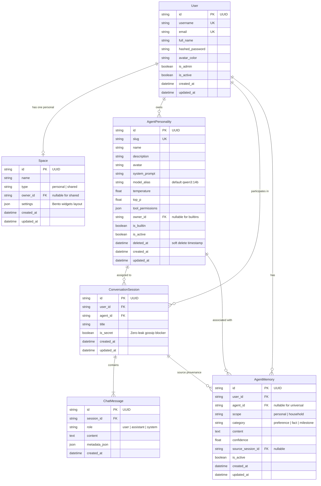

# Household Hub: Stage 1 Architecture Baseline

**Status:** ✅ Completed & Tested  
**Test Suite:** 23 passing tests, 91% code coverage  
**Date:** September 2026

---

## 1. Overview & Scope Delivered

Stage 1 establishes the foundational backend engine for the **Household Hub** homelab platform. Built with **Python 3.12+ (FastAPI)** and **SQLAlchemy 2.0 (asyncio + aiosqlite)**, it provides:

1. **Closed Household Identity Engine:** First-run onboarding wizard for the Household Admin, first-party JWT authentication, and admin-only household member enrollment.
2. **Strict Zero-Leak Spaces Engine:** A collaborative shared household space alongside strictly isolated, private personal spaces.
3. **Dynamic Agent Catalog:** A dynamic registry of AI personalities featuring ownership rules, the 2 core built-in models (`researcher` and `assistant`), and a 7-day soft-delete undo grace period.
4. **Conversation Threads with Secret Mode:** Multi-agent chat session management equipped with an immediate confidentiality flag (`is_secret`) for Zero-Leak privacy.
5. **Agent Long-Term Memory & User Relationship Engine:** Persistent structured memory store enabling agents to learn user habits, dietary preferences, and milestones across sessions with two-tier scoping (`personal` vs `household`), full user audit/revocation, and Secret Mode protection.

---

## 2. Relational Database Schema (SQLite + WAL Mode)

---

## 3. Core Operational Contracts

### 3.1 First-Run Wizard & Authentication
* **Status Check:** `GET /api/v1/auth/status` indicates whether the hub has been initialized (`member_count == 0`).
* **Admin Onboarding:** `POST /api/v1/auth/register-initial` provisions the first registered user as `is_admin=True`, creates their personal space, and initializes the shared hub. Once created, all future calls to `register-initial` are rejected (`400 Bad Request`).
* **Member Provisioning:** `POST /api/v1/users` is restricted to the Admin (`is_admin=True`). Regular members attempting to add users receive `403 Forbidden`.
* **Login & JWT:** `POST /api/v1/auth/login` accepts direct JSON credentials, verifies password hashes using `bcrypt` (12 rounds), and issues signed JWT bearer tokens (`HS256`, 30-day default lifetime).

### 3.2 Spaces Engine & Bento Widgets
* **Shared Hub (`GET /api/v1/spaces/shared`):** Singleton collaborative space accessible to all household members. Holds shared widgets (household calendar, AI launchers).
* **Personal Space (`GET /api/v1/spaces/personal`):** Strictly private workspace for the authenticated user.
* **Strict Zero-Leak Rule:** `GET /api/v1/spaces/{space_id}` enforces that personal spaces can **only** be accessed by their owner (`owner_id == current_user.id`). Even the Household Admin is hard-blocked with `403 Forbidden`.
* **Widget Settings Schema:** Stored in `Space.settings` as flexible JSON, enabling seamless widget additions without database migrations.

### 3.3 Dynamic Agent Catalog & 7-Day Undo Grace Period
* **Built-in System Models:**
  1. **Researcher** (`researcher`): `qwen3:14b`, Temp: 0.3, tools: `["pdf_reader", "searxng_search", "document_writer"]`.
  2. **Assistant** (`assistant`): `qwen3:14b`, Temp: 0.7, tools: `["calendar_read", "calendar_write", "searxng_search"]`.
  * Built-in models cannot be deleted (`400 Bad Request`).
* **Custom Personalities:** Any household member can create custom models via `POST /api/v1/agents`.
* **Ownership Enforcement:** Custom models record `owner_id`. Only the creator can edit or delete their model.
* **7-Day Soft-Delete & Trash:**
  * Calling `DELETE /api/v1/agents/{id}` marks `deleted_at = now()` and hides the model from active listings.
  * Soft-deleted models remain in `GET /api/v1/agents/trash` with a countdown of remaining days.
  * Calling `POST /api/v1/agents/{id}/restore` restores the model within 7 days. After 7 days, restoration is rejected (`410 Gone`).

### 3.4 Conversation Sessions & Secret Mode
* **Session Threads (`/api/v1/sessions`):** Private conversation threads linked to specific agent personalities.
* **Secret Mode (`is_secret: true`):** A persistent confidentiality toggle on any conversation session. Used in Stage 3 to completely sever the session from the household gossip bus.

### 3.5 Agent Long-Term Memory & User Relationships
* **Two-Tier Scoping:**
  * **Personal Memory (`GET /api/v1/memories`):** Stores user habits, preferences, and private constraints. Strictly private to the individual under Zero-Leak rules.
  * **Household Memory (`GET /api/v1/memories/household`):** Shared facts and constraints with user attribution.
* **User Control (Audit & Revoke):** Users can view, edit (`PUT /api/v1/memories/{id}`), or permanently delete (`DELETE /api/v1/memories/{id}`) any memory formed by agents.
* **Secret Mode Hard-Barrier:** Memories originating from a session with `is_secret=True` cannot be saved with `scope="household"` (`400 Bad Request`).

---

## 4. Test Suite Summary

Tests are implemented with `pytest`, `pytest-asyncio`, and an isolated in-memory SQLite engine (`StaticPool`):

| Test Module | Coverage Area | Scenarios Verified | Result |
| :--- | :--- | :--- | :--- |
| `test_health.py` | Health & Engine | DB connectivity, app version | ✅ 1 passed |
| `test_auth.py` | Identity & Roles | First-run wizard, JWT, admin member provisioning, 403 checks | ✅ 6 passed |
| `test_spaces.py` | Spaces & Privacy | Shared hub, Bento widgets, strict Zero-Leak 403 isolation | ✅ 4 passed |
| `test_agents.py` | Agent Catalog | Built-in seeds, custom model ownership, soft-delete, 7-day restore, 410 expiration | ✅ 5 passed |
| `test_sessions.py` | Sessions & Privacy | Session lifecycle, messages, Secret Mode toggle, owner isolation | ✅ 2 passed |
| `test_memories.py` | Agent Memory & Privacy | Personal/household scoping, Zero-Leak 403 isolation, edit/delete audit, secret mode block | ✅ 5 passed |
| **Total** | **23 tests** | **End-to-End API contracts** | **✅ 100% Pass (91% coverage)** |

---

## 5. Handover to Stage 2: Pluggable Integrations Engine

Stage 1 provides all the foundation models, user records, memory engines, and agent tool permission hooks. Stage 2 will directly build on this by implementing the pluggable connectors that fulfill the agent tool permissions:

1. **Google Calendar Connector:** OAuth2 user credential storage + CalDAV sync for the Assistant agent.
2. **Apple iCloud / CalDAV Connector:** CalDAV calendar event reading and merging.
3. **SearXNG Search Connector:** Client querying the homelab SearXNG container (`http://searxng:8080`) for private web lookups.
4. **PyMuPDF Document Reader:** Extracting text, layout, and citations from complex PDFs for the Researcher agent.
5. **Memory Context Preparation:** Providing the structured store for Stage 3's autonomous memory extraction and reflection loop.
