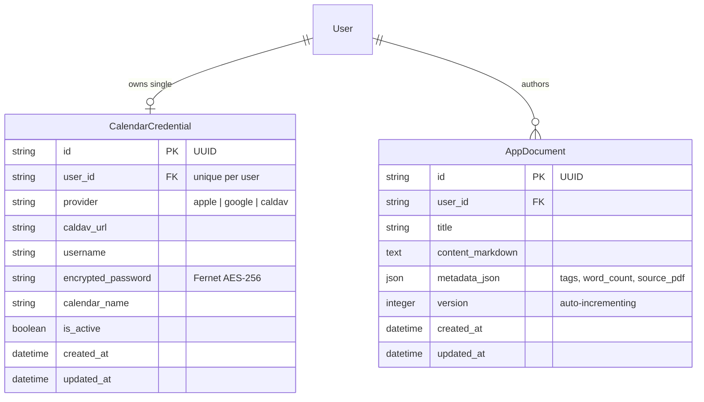

# Household Hub: Stage 2 Architecture Baseline

**Status:** ✅ Hardened & Fully Tested (TDD)  
**Test Suite:** 107 passing tests, 100% pass (Clean Architecture + AST boundary verified)  
**Date:** September 2026

---

## 1. Overview & Scope Delivered

Stage 2 establishes the **Pluggable Integrations Engine** for the **Household Hub** homelab platform. Built with Clean Architecture (`presentation -> domain <- data`, `bootstrap` DI) on **Python 3.12+ (FastAPI)** and **SQLAlchemy 2.0 (asyncio + aiosqlite)**, it provides:

1. **Unified CalDAV Calendar Connector (`calendar_read`, `calendar_write`):**
   * Pluggable CalDAV connector compatible with Apple iCloud, Google Calendar (via CalDAV proxy/direct), and self-hosted Radicale/Nextcloud instances.
   * Single active calendar provider per user with AES-256 (Fernet) encrypted credential storage at rest.
   * Safe key-rotation and corruption recovery: catches `InvalidToken` library errors and maps them to `SecretDecryptionException` returning HTTP 401 Unauthorized.
   * SSRF and URL schema validation: enforces `http://` or `https://` schemas, caps URL length (512 chars), and blocks cloud metadata IPs (`169.254.169.254`, `metadata.google.internal`).
   * Full CRUD operations: read events within bounded timeframes, create events with RFC 5545 recurrence/timezone awareness, patch updates, and delete events.
   * Configurable agent safety kill-switch (`CALENDAR_ALLOW_AGENT_DELETE: bool = True`) to prevent autonomous bulk wiping.

2. **SearXNG Private Homelab Search Connector (`searxng_search`):**
   * Fast, privacy-preserving HTTP client interfacing with the homelab SearXNG container (`http://searxng:8080`).
   * Persistent HTTP connection pooling (`httpx.AsyncClient`) with graceful lifecycle cleanup on application shutdown, eliminating socket churn.
   * In-memory cache with 15-minute TTL and manual freshness bypass (`fresh: bool = True`).
   * Strict 8.0s timeout with circuit-breaking fallback for external network failures.
   * Role-based search profiles: general web queries for the `assistant` personality; strictly reputable academic sources (arXiv, Wikipedia, Wikidata, WolframAlpha) for the `researcher` personality.

3. **PyMuPDF Document Reader & Extractor (`pdf_reader`):**
   * Multi-part PDF upload supporting documents up to 50MB with chunked streaming size validation (64KB chunks) and guaranteed file descriptor cleanup (`try...finally: await file.close()`).
   * Configurable timeout headroom (`PDF_PARSER_TIMEOUT_SECONDS = 30.0`).
   * High-fidelity structural parsing: section-level chunking, page tagging (`[Page X]`), heading hierarchy detection, and citation reference extraction.
   * Immediate fast-fail (`422 Unprocessable Entity`) on scanned/0-text raster PDFs to prevent hallucination and wasted compute. Empty files reject immediately (`400 Bad Request`).
   * Ephemeral binary lifecycle: raw `.pdf` binary is discarded immediately after parsing, storing only structured textual chunks.

4. **Relational Document Store & Export (`document_writer`):**
   * Structured persistence in the `app_documents` SQLite table supporting `create`, `append`, and `replace` operations with auto-incrementing `version` tracking.
   * Strict input string validation: length limits enforced on titles, tags, and content.
   * Dedicated `.md` raw download endpoint (`GET /api/v1/integrations/documents/{id}/export`) with `Content-Disposition: attachment`.

5. **Strict Secret Mode External Tool Lock & Zero-Trust Session Binding:**
   * Hardware-enforced confidentiality barrier: when a chat session has `is_secret == True`, external write tools (`calendar_write`, `document_writer`) are hard-locked (`ToolPermissionDeniedException`, `403 Forbidden`).
   * Read tools (`calendar_read`, `searxng_search`, `pdf_reader`) remain enabled to allow research without data leakage.
   * Mandatory session binding: `session_id` is strictly required on `ToolExecutionRequest`, eliminating omission fallback bypass vectors.

6. **Tool Dispatcher with Soft Degradation:**
   * Uniform tool discovery schema complying with OpenAI/Ollama function calling specifications for Stage 3 inference readiness.
   * Safe execution wrapper catching upstream service timeouts, authentication failures, and network faults, returning conversational diagnostics (`{"success": false, "error": "..."}`) rather than crashing chat turns.

---

## 2. Relational Database Schema Additions

---

## 3. Core Operational Contracts & Endpoints

### 3.1 Tools Discovery & Execution
* **List Available Tools:** `GET /api/v1/integrations/tools`
  * Emits tool definitions with OpenAI/Ollama function calling specifications, parameter schemas, required fields, and read/write classification.
* **Execute Tool:** `POST /api/v1/integrations/tools/execute`
  * Body: `ToolExecutionRequestSchema` (`tool_name`, `arguments`, optional `session_id`).
  * Enforces Secret Mode tool lock: if `session.is_secret == True` and tool is `calendar_write` or `document_writer`, execution is blocked with `403 Forbidden`.
  * Soft degradation: upstream connector failures (e.g. invalid CalDAV credentials, SearXNG timeout) return `ToolExecutionResponseSchema` with `success: false` and friendly error message.

### 3.2 CalDAV Calendar Integration
* **Configure Calendar:** `POST /api/v1/integrations/calendar`
  * Encrypts password using Fernet AES-256 before persisting in SQLite.
  * Overwrites or updates existing credential (single provider per user constraint).
* **Get Configured Calendar:** `GET /api/v1/integrations/calendar`
  * Returns user's active calendar config with password masked (`********`).
* **Disconnect Calendar:** `DELETE /api/v1/integrations/calendar`
  * Permanently removes calendar credentials for the user.
* **List Events:** `GET /api/v1/integrations/calendar/events`
  * Query parameters: `start_time`, `end_time` (ISO 8601). Normalizes all all-day events and RFC 5545 dates to UTC `datetime.datetime`.
* **Create Event:** `POST /api/v1/integrations/calendar/events`
* **Update Event:** `PATCH /api/v1/integrations/calendar/events/{event_id}`
* **Delete Event:** `DELETE /api/v1/integrations/calendar/events/{event_id}`
  * Enforces `CALENDAR_ALLOW_AGENT_DELETE` configuration.

### 3.3 SearXNG Search Integration
* **Execute Search:** `POST /api/v1/integrations/search`
  * Parameters: `query`, `category` (`general` | `academic` | `news` | `it`), `max_results` (bounded 1-50), `fresh` (bypass in-memory cache).
  * Strict 8.0s timeout.

### 3.4 PyMuPDF Document Reader
* **Parse PDF:** `POST /api/v1/integrations/documents/pdf`
  * Multipart file upload (`multipart/form-data`).
  * Fast-fails on 0-text scanned PDFs with clear diagnostic message.
  * Chunks text by headings with `[Page X]` tags. Discards binary immediately.

### 3.5 Document Storage & Markdown Export
* **Save / Append Document:** `POST /api/v1/integrations/documents`
  * Supports `create`, `append`, and `replace` actions.
* **List User Documents:** `GET /api/v1/integrations/documents`
* **Get Document by ID:** `GET /api/v1/integrations/documents/{id}`
* **Export Markdown:** `GET /api/v1/integrations/documents/{id}/export`
  * Returns `text/markdown` file download with `Content-Disposition: attachment; filename="{title}.md"`.
* **Delete Document:** `DELETE /api/v1/integrations/documents/{id}`

---

## 4. Test Suite Summary

Total Backend Test Suite: **107 passing tests** across 18 modules (100% pass).

| Test Module | Coverage Area | Scenarios Verified | Result |
| :--- | :--- | :--- | :--- |
| `test_architecture_boundaries.py` | Architecture Boundaries | AST boundary tests: domain has 0 framework imports, presentation has 0 data imports, data has 0 presentation imports, all DI providers are async coroutines | ✅ 4 passed |
| `test_connectors.py` | Connector Implementations | PyMuPDF PDF extraction & scanned PDF rejection, SearXNG persistent connection pooling & LRU caching (max 500 entries) & expiration cleanup, CalDAV RFC 5545 date normalization & atomic in-place updates preserving UIDs | ✅ 8 passed |
| `test_integration_data.py` | Data & Repositories | Fernet AES-256 encryption roundtrip & tampered secret exception, CalendarCredential repository CRUD, Document repository CRUD with auto-incrementing versions | ✅ 3 passed |
| `domain/test_integration_entities.py` | Integration Domain Entities | CalendarEvent, IntegrationCredential, SearchResult, DocumentChunk, ToolDefinition dataclass immutability & validation | ✅ 6 passed |
| `domain/test_integration_use_cases.py` | Integration Use Cases | Tool execution dispatch, Secret Mode write block, soft error degradation, Calendar CRUD, Document versioning | ✅ 8 passed |
| `presentation/test_integration_mappers.py` | Presentation Mappers | Schema-to-entity and entity-to-schema serialization for credentials, events, documents, and tools | ✅ 2 passed |
| `test_integrations.py` | End-to-End API Integration | Full API routes: tools list, mandatory session binding & permission checks, chunked streaming PDF upload & empty checks, SSRF and length bounds, corrupted secret 401 recovery, document persistence, Markdown export, cross-user isolation | ✅ 10 passed |
| *Baseline Stage 1 Tests* | Identity, Spaces, Catalog, Memory | Auth, users, spaces, agent soft-delete, sessions, memory privacy, health | ✅ 66 passed |
| **Total** | **107 tests** | **Comprehensive Clean Architecture test coverage** | **✅ 100% Pass** |

---

## 5. Handover to Stage 3: AI Inference, Tool Execution, Autonomous Memory & Gossip Bus

With the pluggable integrations engine completed, Stage 3 can proceed to implement:
1. **Ollama Streaming Client (`qwen3:14b`):** Connecting to the local RTX 5080 inference server.
2. **Tool Execution Pipeline:** Passing tool specifications from `GET /api/v1/integrations/tools` to Ollama and dynamically dispatching tool calls back through `POST /api/v1/integrations/tools/execute`.
3. **Autonomous Memory Extraction Loop:** Extracting preferences and facts asynchronously from user conversations.
4. **Attributed Gossip Bus:** Directional milestone sharing across agents with explicit user attribution and Secret Mode hard-blocks.
