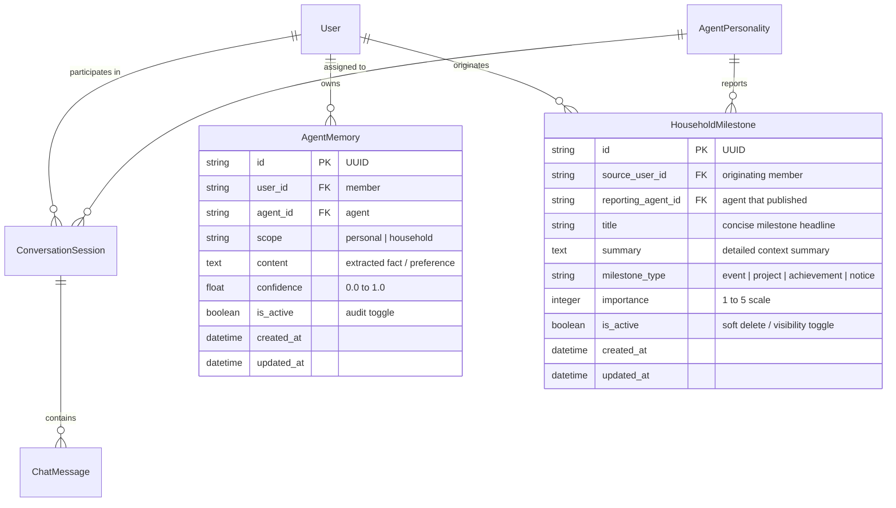

# Household Hub: Stage 3 Architecture Baseline

**Status:** ✅ Hardened & Fully Tested (TDD)  
**Test Suite:** 157 passing tests, 100% pass (Clean Architecture + AST boundary verified)  
**Date:** September 2026

---

## 1. Overview & Scope Delivered

Stage 3 establishes the **AI Inference, Tool Execution, Autonomous Memory & Attributed Gossip Bus** for the **Household Hub** homelab platform. Built with Clean Architecture (`presentation -> domain <- data`, `bootstrap` DI) on **Python 3.12+ (FastAPI)** and **SQLAlchemy 2.0 (asyncio + aiosqlite)**, it provides:

1. **Local AI Inference Pipeline (`qwen3:14b` on RTX 5080):**
   * Non-blocking HTTP client (`OllamaLLMConnector`) interfacing with local Ollama (`http://127.0.0.1:11434`) via standardized OpenAI-compatible endpoints (`/v1/chat/completions`).
   * Persistent HTTP connection pooling (`httpx.AsyncClient`) with clean application lifecycle disposal.
   * OpenAI-compatible function calling specifications: converts domain tool definitions into structured function tools, parsing both tool call arrays and response content.

2. **Progressive Token-by-Token SSE Streaming (`ProcessChatTurnUseCase.execute_stream`):**
   * Real-time word-by-word typing experience: emits granular Server-Sent Events (`{"type": "delta", "content": chunk}`) as tokens stream from Ollama.
   * Fast-path optimization: agents without tools bypass blocking non-streaming calls, streaming tokens immediately.
   * Tool-augmented streaming: agents with tools run tool calls via `chat_completion`, emit `tool_executing` and `tool_result` status updates, and then stream the final synthesized answer token-by-token.
   * Turn completion event: emits `{"type": "done", "message_id": ..., "assistant_content": ...}` and persists the aggregated assistant response to SQLite upon stream completion.

3. **Context Assembly & Prompt Injection Neutralization:**
   * Dynamic prompt compilation assembling agent system instructions, member profiles, active personal memories, household facts, recent gossip milestones, and recent conversation history (up to 30 messages).
   * Robust prompt defense (`_sanitize_prompt_snippet`): strips system prompt delimiter tokens (`System:`, `<|im_start|>`, `###`, `---`) from user memories and milestones, neutralizing indirect prompt injection attacks.
   * Secret Mode protection: sessions marked with `is_secret == True` or triggering privacy triggers automatically suppress personal memories from leaking into shared scopes and omit the gossip bus.

4. **Autonomous Memory Reflection & Semantic Deduplication (`ReflectTurnUseCase`):**
   * Autonomous background extraction: runs after turn completion to identify new member preferences, dietary constraints, project updates, and milestones.
   * In-place semantic deduplication: normalizes extracted memory text against existing active memories. If a matching memory exists, updates confidence (`max(existing.confidence, new_conf)`) and refreshes timestamps rather than creating duplicate database rows.
   * Two-tier memory scoping: strictly isolates `scope="personal"` facts to the user under Zero-Leak rules; attributes `scope="household"` facts to the household collaborative scope.

5. **Attributed Gossip Bus (`household_milestones`):**
   * Directional, user-attributed context stream where agents publish notable milestones (e.g., project deadlines, upcoming trips, achievements).
   * Strict relational awareness: milestones track `source_user_id`, `reporting_agent_id`, `title`, `summary`, `importance`, and `created_at`.
   * Milestone sanitization & deduplication: sanitizes delimiter tokens and prevents duplicate milestone generation across parallel sessions.
   * Secret Mode severed: sessions with `is_secret == True` are strictly prohibited from publishing milestones to the gossip bus.

6. **Durable Background Stream Execution & Concurrency Governance:**
   * Client disconnect resilience: background streaming tasks run in dedicated worker coroutines with isolated, request-independent `AsyncSessionLocal` database transactions, preventing transaction abortion on early HTTP client drops.
   * Synchronous session locking (`SessionLockRegistry`): calls `try_acquire(session_id)` immediately in the HTTP router before returning headers. Concurrent turns on the same session receive immediate `HTTP 409 Conflict`.
   * Atomic memory cleanup: locks are pruned atomically from memory upon turn completion, preventing unbounded dictionary growth.

7. **Upstream LLM Exception Mapping & CORS Lockdown:**
   * Clean status code mapping: maps `LLMInferenceException` to `HTTP 504 Gateway Timeout` for read timeouts, and `HTTP 502 Bad Gateway` for connection drops or 5xx failures from Ollama.
   * Strict CORS lockdown: default `CORS_ORIGINS` locked down to `["https://spicy-llama.duckdns.org"]` with regex matching DuckDNS subdomains (`^https://([a-zA-Z0-9-]+\.)?spicy-llama\.duckdns\.org$`) and `allow_credentials=True`.
   * Native mobile app compatibility: verified that native Android/iOS clients (using KMP & Ktor OS sockets) operate outside browser sandboxes and bypass CORS, while web visitors are strictly whitelisted and malicious origins rejected.

---

## 2. Relational Database Schema Additions

---

## 3. Core Operational Contracts & Endpoints

### 3.1 Synchronous & Streaming Chat Turns
* **Execute Chat Turn (Synchronous):** `POST /api/v1/sessions/{id}/chat`
  * Body: `{"content": "...", "auto_approve_writes": false}`
  * Runs tool loops up to `MAX_TOOL_CALL_ITERATIONS`, synthesizes response, triggers background memory reflection, and returns `ChatTurnResponseSchema`.
* **Execute Chat Turn (Progressive SSE Stream):** `POST /api/v1/sessions/{id}/stream`
  * Body: `{"content": "...", "auto_approve_writes": false}`
  * Returns `text/event-stream` emitting SSE events:
    * `{"type": "tool_executing", "tool": "calendar_read", "arguments": {...}}`
    * `{"type": "tool_result", "data": {...}}`
    * `{"type": "delta", "content": "..."}` (token-by-token deltas)
    * `{"type": "done", "message_id": "...", "assistant_content": "...", ...}`
  * Concurrency: returns `HTTP 409 Conflict` if a turn is already in progress on the session.

### 3.2 Attributed Gossip Bus
* **List Household Milestones:** `GET /api/v1/gossip/milestones`
  * Query parameters: `limit` (default 20), `since` (ISO datetime).
  * Emits active milestones sorted by `created_at` descending, with source user and reporting agent attribution.
* **Revoke Milestone:** `DELETE /api/v1/gossip/milestones/{id}`
  * Members can revoke or delete milestones originated by their conversations.

---

## 4. Test Verification & Quality Metrics

All Stage 3 capabilities were implemented following strict Test-Driven Development (Red-Green-Refactor):

| Suite | Component | Test Count | Result |
| :--- | :--- | :--- | :--- |
| `tests/domain/test_chat_turn.py` | Turn execution, write confirmations, progressive token streaming | 6 | **Passed** |
| `tests/domain/test_assemble_context.py` | Context assembly, prompt injection defense, secret mode | 4 | **Passed** |
| `tests/domain/test_reflect_turn.py` | Autonomous memory reflection, semantic deduplication, milestones | 4 | **Passed** |
| `tests/domain/test_gossip_use_cases.py` | Milestone publishing, listing, and user revocation | 3 | **Passed** |
| `tests/presentation/test_session_lock.py` | Try acquire, release, 409 conflict, lock pruning | 5 | **Passed** |
| `tests/presentation/test_gossip_presentation.py` | Gossip REST routes, schemas, and mappers | 2 | **Passed** |
| `tests/test_sessions.py` | Chat session lifecycle, lock concurrency, provenance, 502/504 mapping | 11 | **Passed** |
| `tests/test_cors.py` | DuckDNS origin whitelist, subdomain regex, unauthorized origin rejection | 3 | **Passed** |
| `tests/test_stage3_e2e.py` | End-to-end SSE chat stream, tool loop, reflection & gossip bus | 6 | **Passed** |
| `tests/architecture/test_architecture_boundaries.py` | Clean Architecture AST boundary verification (`presentation -> domain <- data`) | 4 | **Passed** |
| **Total Test Suite** | **Full backend platform test suite (`pytest`)** | **157** | **100% Pass** |

---

## 5. Architectural Invariants for Stage 4 KMP Integration

When implementing the Kotlin Multiplatform shared client core (`:shared`) in Stage 4:
1. **Network Engine:** Use Ktor HTTP client (`io.ktor:ktor-client-core`) configured with `CIO` / `OkHttp` engines for Android/Desktop, `Darwin` for iOS, and `Js`/`Wasm` for Web.
2. **Native Transport:** Native mobile targets will communicate over raw TCP/HTTP sockets without `Origin` headers, operating cleanly with backend CORS settings.
3. **SSE Ingestion:** Ingest `/api/v1/sessions/{id}/stream` using Ktor's SSE extension or chunked response reader, mapping `delta` events to a Kotlin `StateFlow<String>` in ViewModels for word-by-word streaming rendering.
4. **Session Lock Handling:** Handle `HTTP 409 Conflict` gracefully in client repositories, reflecting session busy states in UI controls.
5. **Gateway Fault Handling:** Handle `HTTP 502 Bad Gateway` and `HTTP 504 Gateway Timeout` with structured retry and offline state indicators.
