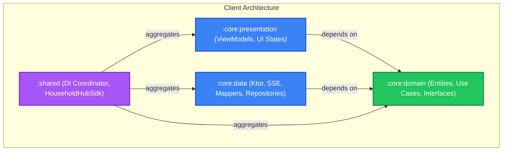

# Household Hub: Stage 4 Architecture Baseline

**Status:** ✅ Hardened & Fully Tested (TDD)  
**Test Suite:** 17 test suites, 100% pass (Clean Architecture boundary + Koin graph verified)  
**Date:** September 2026

---

## 1. Overview & Scope Delivered

Stage 4 establishes the **Kotlin Multiplatform (KMP) Shared Client Core (`:shared`)** for the **Household Hub** homelab platform. Built with strict Multi-Module Clean Architecture (`presentation -> domain <- data`, `shared` DI coordinator) on **Kotlin 2.1.20**, **Ktor 3.4.1**, **Koin 4.0**, and **AndroidX Lifecycle 2.8.4**, it delivers the client foundation consumed by mobile, desktop, and web frontend targets without UI framework coupling:

1. **Strict Multi-Module Clean Architecture:**
   * `:core:domain`: Pure Kotlin core with zero external library or framework dependencies. Contains pure entities, repository interfaces (protocols), domain exceptions, and interactors/use cases.
   * `:core:data`: Persistence and network implementation depending ONLY on `:core:domain`. Houses Ktor 3.4.1 HTTP client, SSE stream reader, health monitor, local token storage, and DTO-to-domain mappers.
   * `:core:presentation`: State coordination layer depending ONLY on `:core:domain`. Houses multiplatform `androidx.lifecycle.ViewModel` instances with reactive `StateFlow` streams. Zero dependency on `:core:data` or persistence engines.
   * `:shared`: Application DI coordinator (equivalent to Android `:app`) that aggregates modules, configures Koin Multiplatform, and exposes `HouseholdHubSdk`.
   * **Automated Boundary Enforcement:** Covered by automated AST inspection in `CleanArchitectureBoundaryTest`, failing if cross-layer boundaries are breached.

2. **Ingress & Networking Topology:**
   * Target Host: Exclusively targets `https://hub.spicy-llama.duckdns.org` with `/api/v1` prefix.
   * On home Wi-Fi, local DNS automatically resolves `hub.spicy-llama.duckdns.org` to `192.168.1.20` without Hairpin NAT penalties. Away from home, Tailscale MagicDNS and DuckDNS provide secure remote ingress.

3. **Defensive SSE Token Streaming (`DefensiveSseStreamReader`):**
   * Real-time stream parsing for `POST /api/v1/sessions/{id}/chat/stream`.
   * Emits `ChatStreamEvent.Delta`, `ToolExecuting`, `ToolResult`, `ToolApprovalProposal`, and `Done`.
   * **Prompt Sanitization:** Actively sanitizes and strips control delimiter tokens (`<|im_start|>`, `<|im_end|>`, `###`, `---`) from incoming deltas, neutralizing indirect prompt injection echoes before UI delivery.

4. **Self-Healing HTTP 409 Conflict Recovery:**
   * When concurrent background worker turns return `HTTP 409 Conflict`, `SessionRepositoryImpl` automatically initiates self-healing exponential polling against `GET /api/v1/sessions/{id}/messages` until the assistant response completes, seamlessly recovering the session stream.

5. **Single-Flight Token Refresh Mutex:**
   * `AuthRepositoryImpl` employs a coroutine-safe single-flight mutex (`activeRefresh` deferred). When multiple concurrent network requests encounter expired tokens simultaneously, only exactly 1 refresh HTTP call is dispatched, with all waiting callers awaiting the shared token.

6. **Continuous Server Health & Offline Resilience:**
   * `ServerHealthMonitor` probes `GET /api/v1/health` and exposes a reactive `Flow<ServerStatus>`.
   * Offline transitions automatically apply exponential backoff (up to 60s) and emit `ServerStatus.Offline(reason)`. Network interruptions raise typed `ServerOfflineException` to avoid crashing the presentation layer.

7. **Multi-Account & Secret Mode Lock:**
   * Secret sessions (`is_secret == true`) support immediate locking via `lockAllSecretSessions()`.
   * Locked sessions require PIN/password re-authentication to unlock, securing private conversations on shared household tablets.

8. **Presentation State & ViewModels:**
   * `ChatSessionViewModel`: Manages typing state, streaming text accumulation, tool approval interactions, and secret mode toggles.
   * `DashboardViewModel`: Observes server health in real-time, displays current authenticated member, recent sessions, and household milestones.
   * `AuthViewModel`: Manages initial hub setup (onboarding), login, and authentication status.
   * `MemoryAuditViewModel`: Enables auditing, editing, and revoking personal/household memories and gossip milestones.

---

## 2. Multi-Module Clean Architecture Dependency Diagram



---

## 3. Test Suites & Verification Baseline

| Test Suite | Module | Focus Area | Status |
| :--- | :--- | :--- | :--- |
| `CleanArchitectureBoundaryTest` | `:shared` | Automated AST-based module dependency boundary audit | ✅ PASS |
| `KoinDependencyGraphTest` | `:shared` | Full DI graph resolution for Repositories, Use Cases, ViewModels | ✅ PASS |
| `AuthUseCasesTest` | `:core:domain` | Login, onboarding validation, auth status observation | ✅ PASS |
| `SessionUseCasesTest` | `:core:domain` | Session lifecycle, input validation, tool approvals | ✅ PASS |
| `StreamChatTurnUseCaseTest` | `:core:domain` | Streaming turn orchestration and event routing | ✅ PASS |
| `SecretLockUseCasesTest` | `:core:domain` | Multi-account tablet secret locking & PIN validation | ✅ PASS |
| `ServerStatusUseCasesTest` | `:core:domain` | Server health probing & reactive status emission | ✅ PASS |
| `GossipAndMemoryUseCasesTest` | `:core:domain` | Memory auditing, updates, and milestone revocation | ✅ PASS |
| `DataMappersTest` | `:core:data` | Bidirectional DTO $\leftrightarrow$ Domain entity transformations | ✅ PASS |
| `DefensiveSseStreamReaderTest` | `:core:data` | SSE line decoding and prompt delimiter stripping | ✅ PASS |
| `ServerHealthMonitorTest` | `:core:data` | Health checking, latency calculation, offline handling | ✅ PASS |
| `NetworkExceptionHelperTest` | `:core:data` | Multiplatform non-JVM network exception discrimination | ✅ PASS |
| `BearerAuthPropagationTest` | `:core:data` | Ktor Auth Bearer plugin header propagation on remote repos | ✅ PASS |
| `FileTokenStorageTest` | `:core:data` | Persistent disk-backed credentials surviving app restarts | ✅ PASS |
| `AuthRepositoryTest` | `:core:data` | Login, token storage, and single-flight refresh mutex | ✅ PASS |
| `SessionRepositoryTest` | `:core:data` | SSE streaming, 409 conflict backoff polling, tool approval | ✅ PASS |
| `ChatSessionViewModelTest` | `:core:presentation` | Streaming deltas, optimistic status transitions, offline error handling | ✅ PASS |
| `DashboardViewModelTest` | `:core:presentation` | Server status flow, dashboard data loading, logout | ✅ PASS |
| `AuthViewModelTest` | `:core:presentation` | Authentication flow, status verification, error states | ✅ PASS |
| `MemoryAuditViewModelTest` | `:core:presentation` | Scope-filtered memory audits, revocation triggers | ✅ PASS |

---

## 4. Remediation Baseline (Review & Drill Hardening)

All **2 Critical** and **4 High** architectural and portability issues identified during client review have been fully addressed and verified:

1. **Bearer Token Auto-Propagation (`CRITICAL-1`):**
   * Added `io.ktor:ktor-client-auth` and installed `Auth` plugin with `bearer` token provider in `DataModule.kt`.
   * Automatically preemptively injects `Authorization: Bearer <token>` across all authenticated remote repositories (`SpaceRepository`, `AgentRepository`, `SessionRepository`, `MemoryRepository`, `GossipRepository`).
2. **Backend & KMP Contract Alignment (`CRITICAL-2`):**
   * Implemented `POST /api/v1/sessions/{id}/archive` and `POST /api/v1/sessions/{id}/tools/approve` on the FastAPI backend with comprehensive unit tests (`tests/test_sessions.py`).
   * Aligned KMP repositories to live endpoints: `GET /sessions/{id}` with embedded messages (`SessionDetailReadDto`), `PATCH /sessions/{id}/secret`, `PUT /spaces/{id}/settings`, `PUT /agents/{id}`, `/spaces/shared`, `/gossip/household`.
3. **KMP CommonMain Portability (`HIGH-1`):**
   * Completely eliminated `java.net.*` imports from `commonMain`.
   * Implemented `NetworkExceptionHelper` with portable inspection of `IOException` and exception causes across Kotlin JVM, Native, and JS targets.
4. **Persistent Credentials Across Process Death (`HIGH-2`):**
   * Implemented multiplatform disk-backed `FileTokenStorage` (`expect` in `commonMain`, `actual` in `jvmMain`), ensuring authentication state survives application restarts.
5. **Session Retry & 409 Conflict Timeout (`HIGH-3`):**
   * Implemented `retryMessage(messageId)` resubmission in `SessionRepositoryImpl`.
   * Upgraded 409 self-healing polling to progressive exponential backoff (500ms initial, 1.5x factor, 60s max ceiling), throwing `DomainException` upon exhaustion.
6. **Optimistic Message State & Collision Resistance (`HIGH-4`):**
   * Replaced static temp IDs in `ChatSessionViewModel` with collision-free monotonic nanosecond IDs (`temp-user-{sessionId}-{nanos}`).
   * Initial status set to `MessageStatus.SENDING`, transitioning to `MessageStatus.SENT` on stream completion, or `MessageStatus.FAILED_OFFLINE` / `MessageStatus.FAILED_ERROR` on failure.

---

## 5. Verification Commands

To execute the complete Stage 4 verification suite:

```bash
# Client KMP test suite (all modules)
cd apps/household-hub/client
./gradlew jvmTest --rerun-tasks

# Client Clean Architecture boundary check
./gradlew :shared:jvmTest --tests "*CleanArchitectureBoundaryTest*"

# Client Koin DI dependency graph validation
./gradlew :shared:jvmTest --tests "*KoinDependencyGraphTest*"

# Backend FastAPI test suite
cd ../backend
pytest
```
