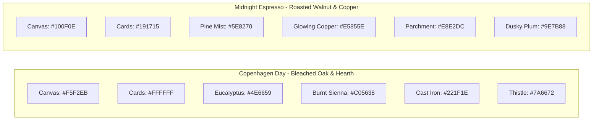

# Household Hub: Stage 5 UI/UX Design & Architecture Specification

**Status:** 📐 Approved Specification & Design System  
**Target Module:** `:composeApp` (Compose Multiplatform — Android, iOS, Desktop, Web Wasm)  
**Date:** September 2026  

---

## 1. Executive Summary & Design Principles

This document establishes the official UI/UX design specifications, component hierarchies, responsive layouts, and design tokens for the **Household Hub** client application (`:composeApp`).

### Core Design Principles:
1. **Hygge-Modernism (Organic Minimalism):**
   * Balances Scandinavian functionalism with domestic warmth.
   * Eliminates sterile corporate tech aesthetics in favor of tactile surfaces, soft-edged Bento containers, expansive breathing room, and gentle diffused elevation.
2. **Dual-Space Clarity (Shared Household vs. Personal Space):**
   * Strict separation between communal family life and private individual spaces.
   * Zero leakage between spaces: personal notes and private calendars remain strictly isolated.
3. **Pure Dialogue Intelligence (Conversational Gossip Bus, Not UI Widgets):**
   * The "Gossip Bus" is strictly an ambient conversational UX intelligence layer — **never** a dashboard widget, card, pinboard, or robotic badge.
   * Agents attribute shared household context naturally through conversation (e.g., *"Emma mentioned earlier that her UPC Studio Jury wraps up Friday..."*) during chat turns, keeping dashboards clean, focused, and free of synthetic filler.
4. **Transparent Glass-Box Privacy:**
   * Autonomous memories extracted by agents are fully inspectable, auditable, and revocable with 1-tap controls in the dedicated **Profile & Memory Audit** screen.
5. **Hardware-Enforced Secret Mode:**
   * When Secret Mode is toggled (`is_secret == true`), the gossip bus is severed and external write tools are hard-locked.

---

## 2. Design System & Theme Tokens

The application features two curated Scandinavian palettes: **Copenhagen Day** (default daylight mode) and **Midnight Espresso** (low-glare evening / night mode).

### 2.1 Color Palettes



| Semantic Role | Copenhagen Day (Light) | Midnight Espresso (Night) | Description & Usage |
| :--- | :--- | :--- | :--- |
| **Canvas / Background** | `#F5F2EB` (Bleached Oak) | `#100F0E` (Roasted Espresso) | App background canvas; reduces glare compared to pure white/black. |
| **Surface / Bento Cards** | `#FFFFFF` (Porcelain White) | `#191715` (Roasted Walnut) | Container surface for Bento cards, dialogs, and bottom bars. |
| **Primary Accent** | `#4E6659` (Eucalyptus Green) | `#5E8270` (Pine Mist) | Primary buttons, active navigation states, user chat bubbles. |
| **Primary Container / Badge** | `#D0DFD5` (On: `#102318`) | `#26352D` (On: `#9BC2AC`) | Low-opacity pill badges, agent model tags. |
| **Secondary Accent** | `#C05638` (Burnt Sienna) | `#E5855E` (Glowing Copper) | Calendar milestone indicators, highlights, warnings. |
| **Secondary Container** | `#FFD5C7` (On: `#541A0B`) | `#381E15` (On: `#FFB091`) | Milestone pills, alert tags. |
| **Secret Mode Accent** | `#7A6672` (Dusky Thistle) | `#9E7B88` (Dusky Plum) | Active Secret Mode border, header indicator, lock icons. |
| **Text Primary** | `#221F1E` (Cast Iron Charcoal) | `#E8E2DC` (Warm Parchment) | Headlines, primary card copy, conversation dialogue. |
| **Text Muted / Secondary** | `#514B47` (Warm Ash) | `#9C948D` (Muted Sand) | Subtitles, event locations, helper text. |
| **Borders & Dividers** | `#DED7CA` / `rgba(0,0,0,0.05)` | `#282420` / `rgba(255,255,255,0.06)` | Subtle structural container strokes. |

### 2.2 Typography Pairings
* **Display & Headlines:** `Outfit` (Medium `500`, SemiBold `600`, Bold `700`) — friendly, geometric, welcoming domestic character.
* **Body, Controls & Labels:** `Inter` (Regular `400`, Medium `500`, SemiBold `600`) — pristine readability for schedules, messages, and settings.
* **Metadata & Timestamps:** `JetBrains Mono` (Medium `500`, `11px - 12px`) — crisp machine-readable timestamps and system diagnostics.

### 2.3 Shapes & Elevation
* **Bento Containers:** `24px` corner radius (`RoundedCornerShape(24.dp)`).
* **Inner Elements & List Items:** `12px - 16px` corner radius.
* **Interactive Pills & Badges:** Full round / stadium pill (`RoundedCornerShape(percent = 50)`).
* **Elevation & Shadows:** Ultra-soft diffusion (`blur: 30dp`, `offsetY: 8dp`, `alpha: 4-6%`). No hard or heavy black drop shadows.

---

## 3. Mobile Navigation & Screen Architecture (Portrait Phone)

The mobile experience employs a clean **5-point bottom navigation bar** with an elevated center hero action button, completely eliminating redundant header profile icons and toggle switches.

```
┌────────────────────────────────────────────────────────┐
│ HEADER                                                 │
│ HyggeHub • Household                           [ E ] ──┼──► (Opens Profile & Memory Audit)
├────────────────────────────────────────────────────────┤
│ CONTENT CANVAS                                         │
│ • Household: Communal Briefing, Merged Schedule        │
│ • Schedule:  Full CalDAV Agenda                        │
│ • Chats:     Searchable Past Sessions History          │
│ • My Space:  Personal Briefing, Private Focus          │
├────────────────────────────────────────────────────────┤
│ BOTTOM NAVIGATION BAR                                  │
│  [ 🏠 ]     [ 📅 ]        ( + )       [ 💬 ]    [ 🌿 ] │
│ Household  Schedule     New Chat      Chats    My Space│
│                       (Hero Action)                    │
└────────────────────────────────────────────────────────┘
```

### 3.1 Mobile Destinations & Screens

#### 1. `🏠 Household` Tab (Shared Space Dashboard)
* **Header:** Clean `HyggeHub • Household` branding.
* **Top Right:** Circular User Avatar `[ E ]` (tapping opens the **Profile & Memory Audit** screen).
* **Household Daily Briefing:** Synthesized 2-sentence household summary generated by `qwen3:14b` from today's shared rhythms.
* **Merged Household Schedule Card:** Chronological list of today's events across all members with color-coded avatar markers (`Emma`, `Liam`).
*(No artificial 3rd card or filler; generous Scandinavian breathing room frames the dashboard).*

#### 2. `📅 Schedule` Tab (Full Agenda)
* Comprehensive multi-user calendar agenda synced with Apple iCloud / Google CalDAV.
* Event categorization (Personal, Shared, Academic) with clean time-slot grouping.

#### 3. Center `(+) New Chat` (Hero Action Button)
* Prominently elevated circular button floating above the bottom bar with a soft drop shadow.
* **1-Tap Direct Action:** Immediately opens the **Conversation Screen** with a fresh chat turn.
* **Preselected Agent:** Automatically preselects the default **Home & Life Coordinator**.

#### 4. `💬 Chats` Tab (History List)
* Full searchable list of previous conversation sessions.
* Each session row displays:
  * Agent icon (🌿 *Coordinator*, 📚 *Researcher*)
  * Conversation title / topic
  * Last message snippet and relative timestamp (`10m ago`, `Yesterday`)
  * Secret Mode lock badge (`🔒`) if confidential
* *Note:* No duplicate `+ New Chat` button inside the history header; creation is exclusively driven by the center hero button.

#### 5. `🌿 My Space` Tab (Personal Space Dashboard)
* **Strictly Isolated (Zero-Leak):** Accessible only by the authenticated user.
* **Personal Briefing:** AI digest focused exclusively on the user's private day and deadlines.
* **My Private Calendar:** Filtered view containing only the user's personal appointments from their private CalDAV connector.
*(No artificial 3rd card or task filler; focused and spacious).*

#### 6. Dedicated Profile & Memory Audit Screen (Top-Right `[ E ]` Avatar)
* Triggered by tapping the top-right profile avatar from any dashboard view.
* Contains:
  * User profile details (`Emma Larsson`, `emma@homelab.local`, `Household Admin`).
  * **"What I Know About You" (Memory Audit):** Glass-box inspection of memories formed by agents during conversations, split into **Personal Scope (Zero-Leak)** and **Household Milestones (Gossip Bus)**, each equipped with 1-tap delete/revoke (`✕`).
  * **CalDAV Calendar Connections:** Status of Apple iCloud / Google credentials.
  * **Theme Mode:** Copenhagen Day / Midnight Espresso / System Auto toggle.
  * **Sign Out.**

#### 7. Active Conversation Screen
* **Header:**
  * `← Chats` back button (returns to Chats history).
  * **In-Chat Agent Dropdown:** `[ 🌿 Home Coordinator ▾ ]` (preselected to default, allows switching to Academic Researcher on the fly).
  * **Secret Mode Toggle:** `[ 🔒 Secret: OFF ]` (switches to `[ 🔒 Secret: ON ]` with thistle/plum indicator).
* **Message Stream:**
  * Full-height conversation canvas with word-by-word progressive SSE streaming.
  * User messages in eucalyptus/primary bubbles; agent responses in clean card containers with warm typography.
  * Natural language dialogue incorporating attributed gossip seamlessly.
* **Bottom Bar:** Text input field + send button. No voice input: the backend has no speech-to-text, and phone keyboards already dictate.

---

## 4. Tablet & Desktop Split-Hub Architecture (Landscape 16:10 / 16:9)

On landscape tablets (wall-mounted kitchen displays, desktop browsers), the app adapts into a **65% / 35% Split-Hub**:

```
┌──────────────────────────────────────────────────────────────────────────┐
│ TOP BAR: HyggeHub   [ Household | My Space | Schedule | Chats ]    [ E ] │
├────────────────────────────────────────┬─────────────────────────────────┤
│ LEFT 65%: DYNAMIC SPACE CANVAS         │ RIGHT 35%: AGENT COMPANION      │
│                                        │                                 │
│ • Household: Communal Briefing,        │ • In-Chat Agent Picker          │
│   Merged Schedule, Milestones          │   [ 🌿 Home ▾ ]                 │
│ • My Space: Personal Briefing,         │ • Secret Mode: [ 🔓 ]           │
│   Private Calendar, Personal Focus     │ • Quick [ + ] New Chat Action   │
│ • Schedule: Full Multi-Track Agenda    │ • Full-Height Message Stream    │
│ • Chats: Master Conversation History   │ • Input Bar                     │
└────────────────────────────────────────┴─────────────────────────────────┘
```

### 4.1 Tablet Layout Zones

#### 1. Persistent Top Header
* **Left:** Brand logo (`HyggeHub`) + Primary Navigation Tabs (`Household`, `My Space`, `Schedule`, `Chats`).
* **Right:** Date glance (`Friday, Oct 24` 📅) + Profile Avatar `[ E ]`.

#### 2. Left 65% Dynamic Content Canvas
* **When `Household` is selected:**
  * Top (Wide Bento Card): Communal Household Morning Briefing.
  * Bottom (Full-Width Bento Card): Merged Schedule Timeline with multi-member avatar dots.
* **When `My Space` is selected:**
  * Top (Wide Bento Card): Personal Day Overview.
  * Bottom (Full-Width Bento Card): My Private Calendar Events.
* **When `Schedule` is selected:**
  * Full expanded multi-track calendar agenda across the left canvas.
* **When `Chats` is selected:**
  * Master session history list; clicking any past thread instantly loads it into the right companion station.

#### 3. Right 35% Living Agent Companion Station
* Stays permanently visible on landscape displays, serving as the household's ambient voice.
* **Header:**
  * Agent Picker dropdown: `[ 🌿 Home ▾ ]` (compact, slim pill).
  * Secret Mode toggle: `[ 🔓 ]` (minimal circular icon-only button; turns to closed lock `[ 🔒 ]` and illuminates when active).
  * Quick `(+)` New Chat icon to start a fresh thread without leaving the dashboard.
* **Message Stream:** Live, word-by-word streaming conversation with `qwen3:14b`. Pure natural dialogue with zero robotic badges or citation chips.
* **Input Area:** Text input.

#### 4. Slide-Over Profile & Memory Audit Drawer
* Tapping the top-right avatar `[ E ]` smoothly slides the **Profile & Memory Audit Drawer** over the right side of the screen without navigating away from the dashboard canvas.

---

## 5. Clean Architecture Integration (`:composeApp` with `:core:presentation`)

All screens strictly consume the ViewModels established in Stage 4:

| UI Screen / Component | Consumed ViewModel | StateFlows & Interactors Bound |
| :--- | :--- | :--- |
| **Household Space & My Space** | `DashboardViewModel` | `uiState` (current member, server status), `space` settings, milestones. |
| **Schedule Tab** | `CalendarViewModel` / `DashboardViewModel` | CalDAV events stream, date normalization, member avatar mapping. |
| **Chats History & Active Chat** | `ChatSessionViewModel` | `sessionState`, progressive SSE `messages`, `sendMessage()`, `toggleSecretMode()`, optimistic status tracking (`SENDING`, `SENT`, `FAILED`). |
| **Profile & Memory Audit** | `MemoryAuditViewModel` | `memories`, `milestones`, `deleteMemory()`, `revokeMilestone()`. |
| **First-Run Onboarding & Login** | `AuthViewModel` | `authState`, `registerInitial()`, `login()`. |
