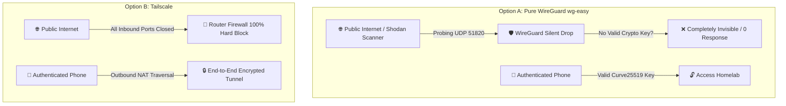
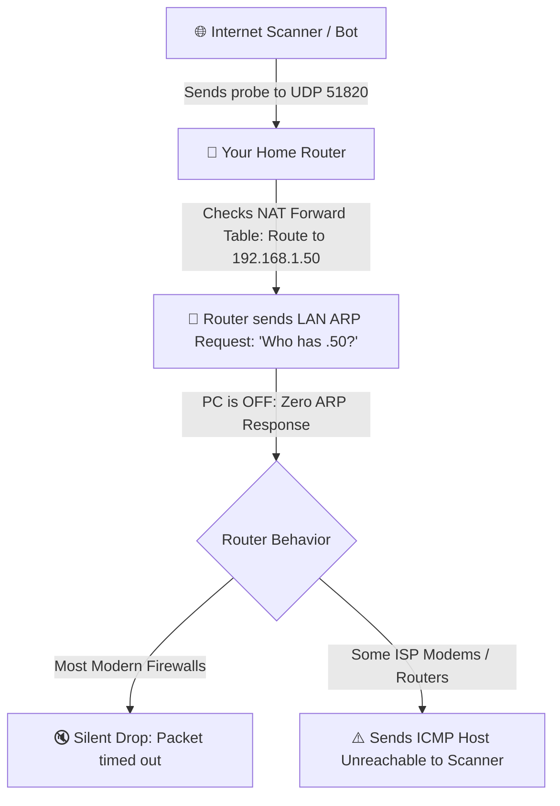

# 🌐 Homelab Ingress & Remote Access Architecture Comparison

This document provides a comprehensive architectural and security comparison between two primary approaches for remote access and URL management in this homelab media stack:
1. **Option A: Pure Self-Hosted WireGuard (`wg-easy`)**
2. **Option B: Tailscale + DuckDNS + Caddy Hybrid (Recommended)**

---

## 📊 High-Level Comparison Matrix

| Criteria | 🅰️ **Pure Self-Hosted WireGuard (`wg-easy`)** | 🅱️ **Tailscale + DuckDNS Hybrid** ⭐ *(Recommended)* |
| :--- | :--- | :--- |
| **Philosophy & Ownership** | **100% Company-Agnostic & Open Source** | Private Mesh Transport + Open-Source Stack |
| **Router Port Forwarding** | **1 UDP Port** (`51820`) | **0 Open Router Ports** (100% closed firewall) |
| **Security When Host PC is OFF** | Dependent on router firmware (may leak `ICMP Host Unreachable` to scanners) | **100% Immune** (No router NAT table entries exist) |
| **Resistance to Port Scanning** | Cryptographic silent-drop (when host is active) | **Invisible** (No open ports to scan on WAN) |
| **Streaming Performance** | **Full ISP Line Speed** (Always direct P2P) | **Full ISP Line Speed** (>95% Direct P2P) + DERP Relay fallback |
| **Strict Hotel / Corp Wi-Fi** | May be blocked if UDP port 51820 is filtered | **Always works** (Automatic encrypted DERP relay) |
| **Non-24/7 Reconnection** | Dynamic IP refreshed via DuckDNS script on boot | Instant reconnection (<5s) with static Tailscale IP |
| **URL Experience** | `https://*.spicy-llama.duckdns.org` on Port 443 | `https://*.spicy-llama.duckdns.org` on Port 443 |
| **Dashboard (Homarr/Homepage)** | **100% Native & Plug-and-play** | **100% Native & Plug-and-play** |
| **Setup & Maintenance** | Requires router port-forwarding & DDNS script | **Zero router configuration**, works out of the box |

---

## 🛡️ Security & Threat Model Breakdown

### 1. Attack Surface & Port Scanning (The "Shodan" Test)



#### Pure WireGuard: Cryptographic Silent-Drop
* WireGuard is designed to be **invisible to unauthorized port scanners**.
* If an unauthenticated probe hits UDP port `51820`, WireGuard simply drops the packet with **zero reply** (no error, no RST, no ICMP packet). To port scanners, the port appears 100% closed.
* Only client devices possessing the correct private key (`Curve25519`) will ever receive a response.

#### Tailscale: Zero Inbound Firewall Exposure
* Your home router maintains a **100% closed inbound firewall policy**.
* Connections are formed by client devices reaching *outbound* to coordinate peer-to-peer NAT traversal.

---

### 2. Security When the Host PC is Powered Off (Non-24/7 Operation)

This is a critical security distinction for homelabs that do not run 24/7:



* **With Pure WireGuard (Port Forwarded):**
  * When the PC is **ON**, the WireGuard software swallows unauthorized scans silently.
  * When the PC is **OFF**, the packet stops at the router. The router attempts an ARP lookup for the host PC. Since the PC is offline, some router models or ISP modems inadvertently reply with an `ICMP Type 3 (Destination Host Unreachable)` packet.
  * *The risk:* That ICMP response confirms to an external scanner that an active port forwarding rule exists at that IP.
* **With Tailscale (Zero Port Forwarding):**
  * There are **zero NAT forwarding rules** on your router.
  * The router WAN interface treats all unsolicited inbound packets with an immediate hard drop.
  * Whether your PC is running at 100% load, sleeping, or powered off, your home network is completely indistinguishable from an offline cable.

---

## ⚡ Streaming Performance & Hardware Acceleration

Both solutions utilize the **WireGuard protocol** (`ChaCha20-Poly1305` AEAD encryption), delivering near line-speed cryptographic performance:

```mermaid
graph TD
    subgraph DirectConn [95%+ of Remote Connections - 5G, Remote Wi-Fi, Friends House]
        CLIENT_A[📱 Phone on 5G] -->|Direct Peer-to-Peer WireGuard| SERVER_A[🍿 Jellyfin + RTX 5080 NVENC]
        CLIENT_A -.->|🚀 Tailscale & Pure WireGuard BOTH achieve 100-500+ Mbps| SERVER_A
    end

    subgraph RestrictiveConn [Strict Symmetric Firewall - Some Hotels / Corporate Wi-Fi]
        CLIENT_B[📱 Phone on Hotel Wi-Fi] -->|Tailscale DERP Encrypted Relay| SERVER_B[🍿 Jellyfin + RTX 5080 NVENC]
        CLIENT_B -.->|⚡ Capped at ~15-25 Mbps (Auto-Transcodes to 1080p)| SERVER_B
    end
```

### 1. Direct Peer-to-Peer Mode (95%+ of Connections)
* **Throughput:** Full ISP upload bandwidth (100–1000+ Mbps).
* **4K Streaming:** DirectPlay of full uncompressed **4K HDR Remuxes (60–80+ Mbps)** without stuttering.
* **Transcoding:** The NVIDIA RTX 5080 NVENC engine transcodes 4K streams at **>10x real-time speed** (<0.05s per segment).

### 2. Relay Mode (Strict Hotel / Corporate Firewalls)
* **Pure WireGuard:** If the remote network filters non-standard UDP ports (like `51820`), the connection will fail completely.
* **Tailscale:** Automatically falls back to an encrypted **DERP relay server** (~15–25 Mbps bandwidth). Jellyfin auto-adapts bitrate and transcodes 4K down to crisp 1080p seamlessly.

---

## 🔌 Non-24/7 Power Lifecycle & Reconnection

When operating the server on a non-24/7 schedule (powering down or sleeping when not in use):

1. **Client Device Safety (Split-Tunneling):**
   * Both solutions are configured in split-tunnel mode. Only requests targeting homelab domains (`*.spicy-llama.duckdns.org`) or internal IPs route through the tunnel. Normal phone cellular data (Google, YouTube, Spotify) remains uninterrupted when the server is powered off.
2. **Instant Reconnection (< 5 seconds):**
   * Tailscale nodes reconnect outbound automatically upon Windows boot.
   * DuckDNS runs a lightweight background sync to refresh the host's public IP if altered by the ISP during downtime.
3. **SSL Certificate Persistence:**
   * Caddy caches Let's Encrypt Wildcard certificates (`*.spicy-llama.duckdns.org`) locally on disk (`config/caddy/data`) for 90 days. Booting the server does not require regenerating certificates.

---

## 🎯 Architectural Recommendation

For a setup requiring:
1. **Zero open web exposure** (No public ports exposed on WAN).
2. **Non-24/7 host usage** (Turned off when not in use without firewall leaks).
3. **Unrestricted 4K HDR streaming** (NVIDIA RTX 5080 NVENC).
4. **Clean subdomain URLs** (`https://<service>.spicy-llama.duckdns.org` on standard port 443).

👉 **Option B (Tailscale + DuckDNS + Caddy Hybrid)** provides the most robust, secure, and maintenance-free architecture.
